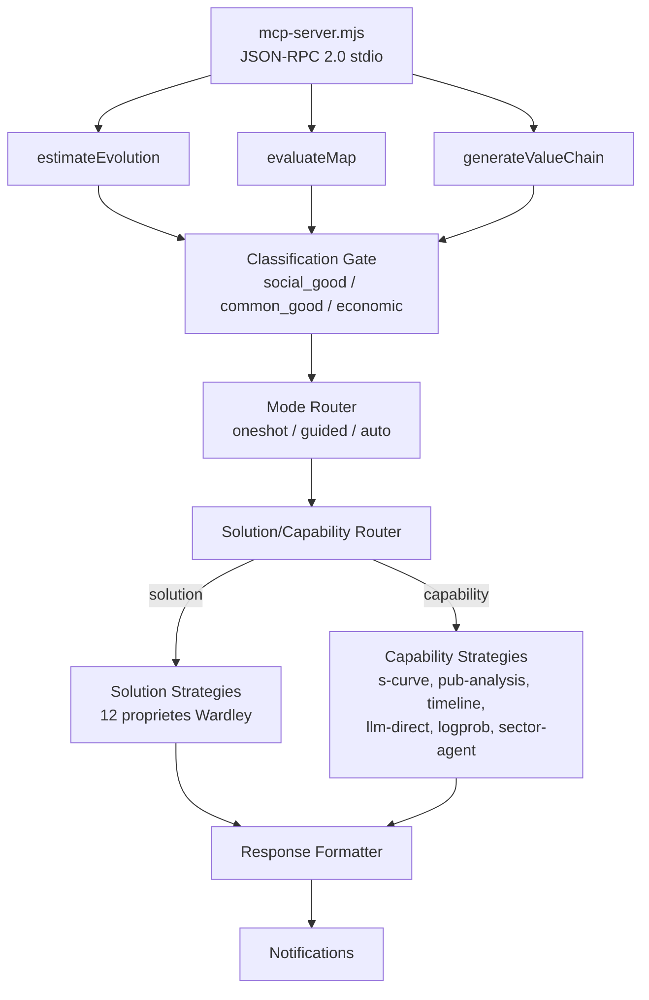

# WardleyAssistant — Documentation

WardleyAssistant est un serveur MCP (Model Context Protocol) qui estime la position d'evolution des composants sur une Wardley Map. Il expose 3 outils via JSON-RPC 2.0 sur stdio et route automatiquement entre deux pipelines d'evaluation :

- **Capability strategies** (6 strategies pluggables) pour les capacites abstraites
- **Solution strategies** (12 proprietes Wardley) pour les produits/solutions nommes

Le routage est transparent : detection automatique via naming, LLM et web search.

## Architecture simplifiee

## Table des matieres

| Document | Description |
|---|---|
| [Demarrage rapide](getting-started.md) | Prerequisites, installation, premier appel |
| [Architecture](architecture.md) | Pipeline, flux de donnees, modules |
| [Reference des outils](tools-reference.md) | Les 3 outils MCP (schemas, parametres, exemples) |
| [Strategies](strategies.md) | Capability (6 strategies) et Solution (12 proprietes Wardley) |
| [Gate de classification](classification-gate.md) | Filtrage social_good / common_good / economic |
| [Configuration](configuration.md) | Variables d'environnement, .mcp.json, channels |
| [Notifications](notifications.md) | Progression temps reel, i18n, gestion d'erreurs |
| [Format .wm](wm-format.md) | Syntaxe OWM pour les cartes de Wardley |
| [Evaluation](evaluation.md) | Framework promptfoo, cas de test, assertions |
| [Extensibilite](extending.md) | Ajouter une strategie, un outil, un backend LLM |
| [Depannage](troubleshooting.md) | Erreurs courantes, debug, FAQ |

## Liens utiles

- [onlinewardleymaps.com](https://onlinewardleymaps.com) — Editeur visuel de cartes OWM
- [docs.onlinewardleymaps.com](https://docs.onlinewardleymaps.com/docs) — Documentation du format OWM
- [modelcontextprotocol.io](https://modelcontextprotocol.io/specification) — Specification MCP
