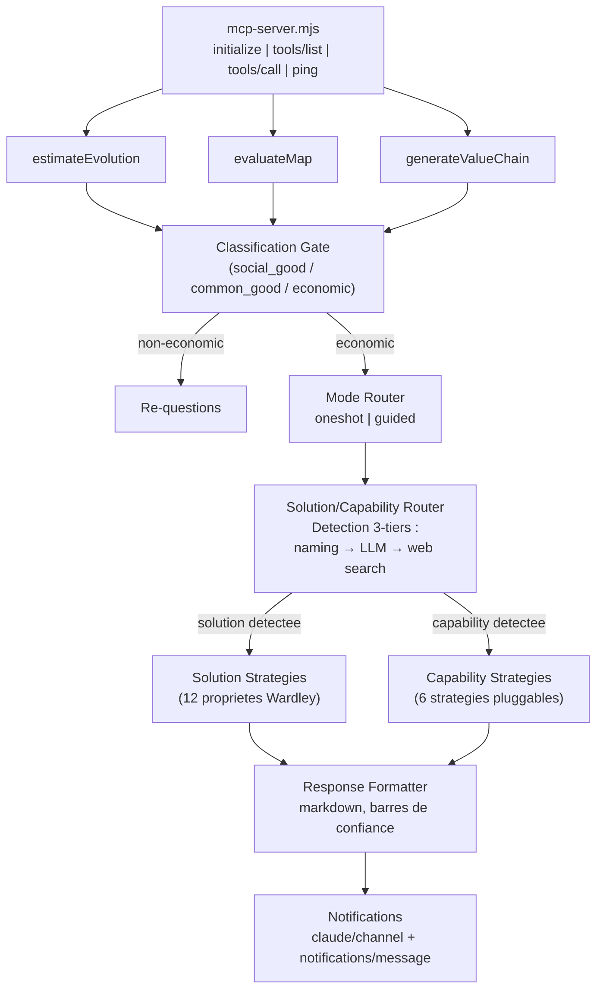
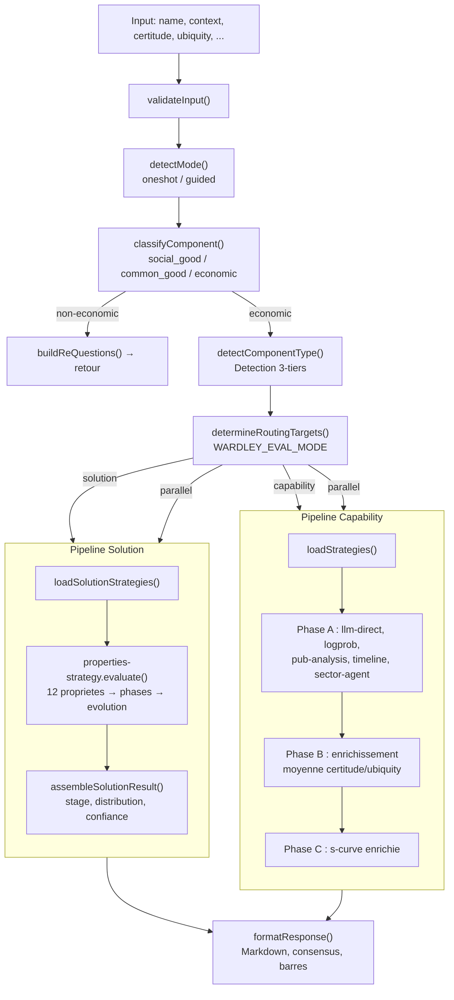
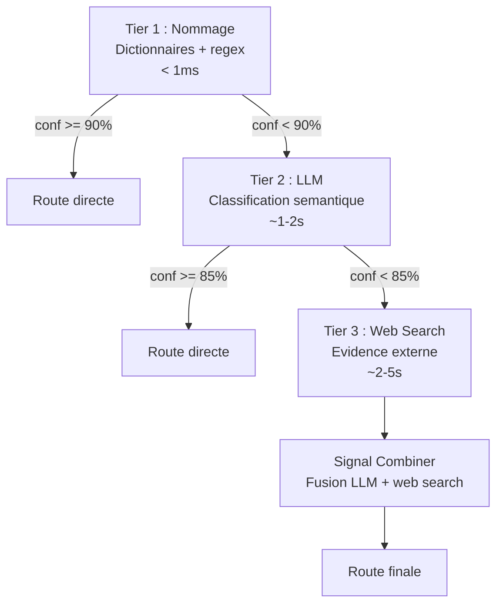
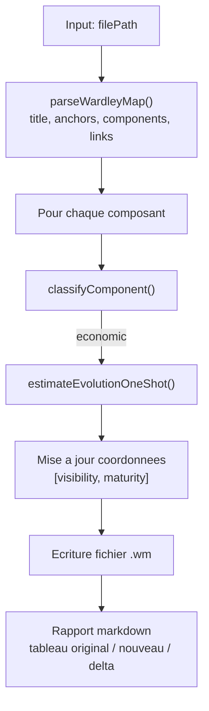
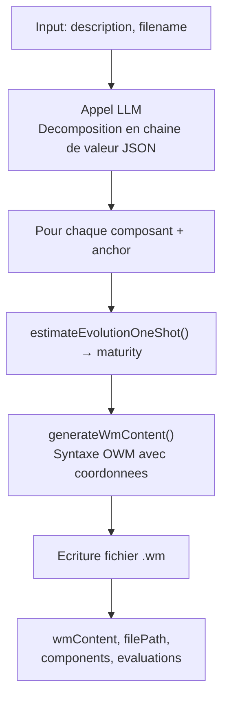

# Architecture

## Vue d'ensemble

WardleyAssistant est un serveur MCP implementant le protocole JSON-RPC 2.0 sur stdio. Il ne depend d'aucun framework externe pour le transport — le serveur lit stdin ligne par ligne et ecrit les reponses sur stdout.

## Pipeline de traitement

## Modules par couche

### Transport MCP

| Module | Role |
|---|---|
| `mcp-server.mjs` | Serveur JSON-RPC 2.0 stdio, registre d'outils, dispatch |
| `mcp-tool.mjs` | Definition et handler de estimateEvolution |
| `evaluate-map.mjs` | Definition et handler de evaluateMap |
| `generate-value-chain.mjs` | Definition et handler de generateValueChain |

### Logique metier

| Module | Role |
|---|---|
| `classification-gate.mjs` | Gate fixe : mots-cles + signaux contextuels → espace economique |
| `mode-router.mjs` | Detection automatique du mode (oneshot/guided) + dispatch |
| `estimate-evolution.mjs` | Orchestration oneshot : classification → strategies → formatage |
| `conversation-session.mjs` | Machine a etats pour le mode guide (5 phases) |
| `skill-handler.mjs` | Parsing de langage naturel → appels API structures |
| `identify-capability.mjs` | Decode les noms techniques (CRM → gestion relation client) via LLM |

### Routage Solution / Capability

| Module | Role |
|---|---|
| `solution-capability-router.mjs` | Detection du type de composant (solution vs capability) et dispatch |
| `detect-solution.mjs` | Heuristiques de nommage + fallback LLM (tiers 1 et 2) |
| `dual-verification-orchestrator.mjs` | Orchestration des 3 tiers de verification avec court-circuit |
| `web-search-verification.mjs` | Verification tier 3 via recherche web |
| `signal-combiner.mjs` | Fusion des signaux LLM + web search en verdict unique |
| `eval-mode-dispatcher.mjs` | Dispatch vers les registres de strategies selon le mode eval |

### Strategies Capability

| Module | Role |
|---|---|
| `strategies/registry.mjs` | Auto-decouverte et cache des fichiers `*-strategy.mjs` |
| `strategies/base-strategy.mjs` | Interface abstraite (`evaluate()` + `validateResult()`) |
| `strategies/s-curve-strategy.mjs` | Modele dual sigmoide (certitude × ubiquite) |
| `strategies/publication-analysis-strategy.mjs` | Distribution wonder/build/operate/usage |
| `strategies/timeline-benchmark-strategy.mjs` | Timeline historique recursive |
| `strategies/llm-direct-strategy.mjs` | Estimation LLM directe (blend 70% s-curve + 30% LLM) |
| `strategies/logprob-distribution-strategy.mjs` | Logprobs OpenCode → distribution de probabilite |
| `strategies/sector-agent-strategy.mjs` | Agent sectoriel specialise |

### Strategies Solution

| Module | Role |
|---|---|
| `solution-strategies/registry.mjs` | Auto-decouverte des fichiers `*-strategy.mjs` dans `solution-strategies/` |
| `solution-strategies/solution-base-strategy.mjs` | Classe abstraite solution (etend `BaseStrategy`) |
| `solution-strategies/properties-strategy.mjs` | Evaluation des 12 proprietes Wardley (auto + conversationnel) |
| `solution-strategies/evolution-properties.json` | Reference : 12 proprietes × 4 phases avec descriptions |
| `solution-strategies/phase-classifier.mjs` | Mapping propriete → phase (1-4) |
| `solution-strategies/aggregate-properties.mjs` | Agregation ponderee des phases en evolution [0-1] |
| `solution-strategies/assemble-result.mjs` | Enrichissement des resultats (stage, distribution, confiance) |
| `solution-strategies/solution-evolution-result.mjs` | Modele de resultat solution avec validation |

### Mathematiques

| Module | Role |
|---|---|
| `s-curve.mjs` | Modele S-curve : sigmoide generalisee, bandes, zones, projection |
| `calibrate-s-curve.mjs` | Calibration des parametres du modele |
| `s-curve-visualizer.html` | Visualiseur interactif HTML5 Canvas |

### Infrastructure LLM

| Module | Role |
|---|---|
| `llm-call.mjs` | Interface multi-backend (Agent SDK + OpenCode) |
| `llm-error-handler.mjs` | Classification d'erreurs (timeout, rate_limit, auth, etc.) |

### Notifications et i18n

| Module | Role |
|---|---|
| `mcp-notifications.mjs` | Emission JSON-RPC (channel + standard), gating verbose |
| `progress-messages.mjs` | Catalogue de messages localises (10 langues, 40+ messages) |
| `language-detect.mjs` | Detection de langue par heuristiques et empreintes |

### Formatage

| Module | Role |
|---|---|
| `response-formatter.mjs` | Resultat → markdown (stade, confiance, raisonnement par strategie) |

## Dual backend LLM

Le systeme supporte deux backends LLM, selectionnes automatiquement :

| Backend | Modele par defaut | Quand | Logprobs |
|---|---|---|---|
| **Claude Agent SDK** | `claude-sonnet-4-6` | Sous-processus MCP (Agent SDK spawne un child) | Non |
| **OpenCode API** | `kimi-k2.5` | Session interactive Claude Code | Oui |

**Pourquoi deux backends ?** Le Claude Agent SDK cree un sous-processus qui entre en conflit avec une session Claude Code active. Quand le serveur tourne dans Claude Code, il utilise OpenCode pour eviter ce conflit. La variable `_WARDLEY_NESTED` est positionnee automatiquement par le serveur au demarrage.

**Configuration** : Le modele est configurable via `WARDLEY_LLM_MODEL` (env var).

## Guard anti-recursion

Le serveur MCP positionne `_WARDLEY_NESTED=1` au demarrage. Si un processus enfant herite de cette variable et tente de demarrer un second serveur MCP, il quitte proprement sans erreur. Cela empeche le spawn infini quand l'Agent SDK re-invoque le MCP.

## Flux de donnees — estimateEvolution

### Detection solution vs capability — pipeline 3-tiers

Le routeur determine si un composant est une **solution nommee** (Kubernetes, Salesforce, SAP ERP) ou une **capability abstraite** (container orchestration, CRM, ERP). Le choix du pipeline d'evaluation en depend.

Le **Signal Combiner** fusionne les signaux LLM et web search en un verdict unique :
- Accord → bonus de confiance (+0.10)
- Desaccord → poids LLM (0.45) vs web search (0.55), penalite de confiance (-0.10)
- Signal manquant → degradation (×0.85)

## Flux de donnees — evaluateMap

## Flux de donnees — generateValueChain

