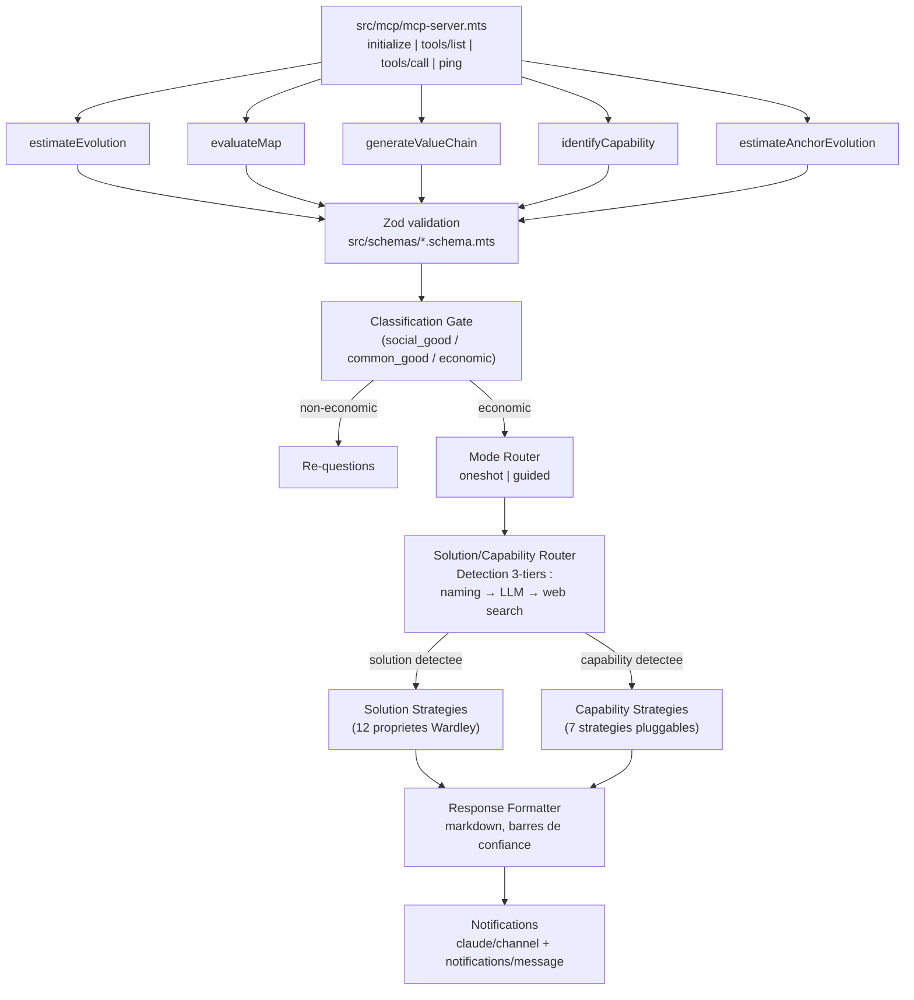
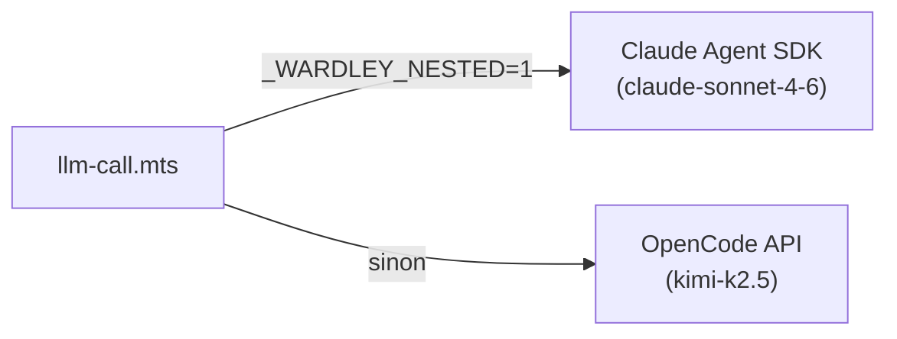
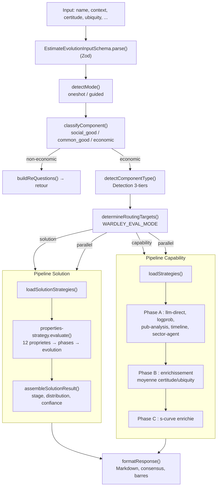
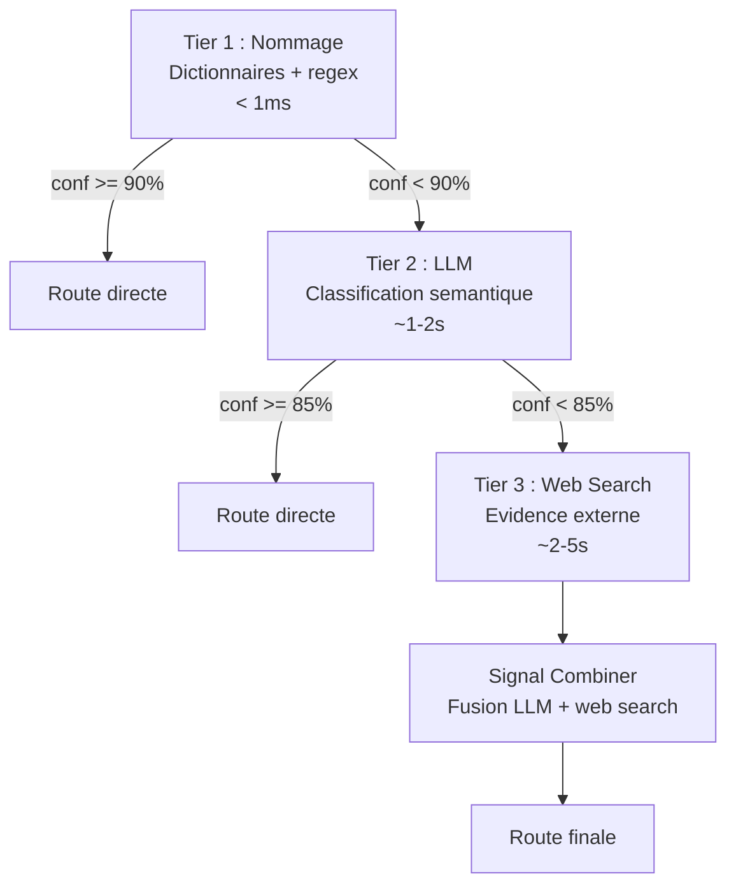
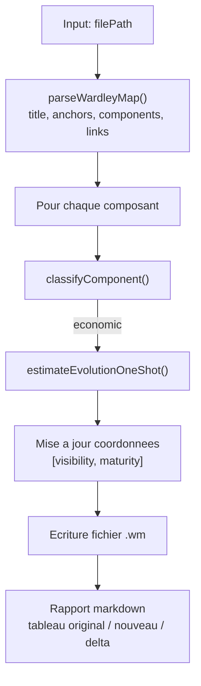
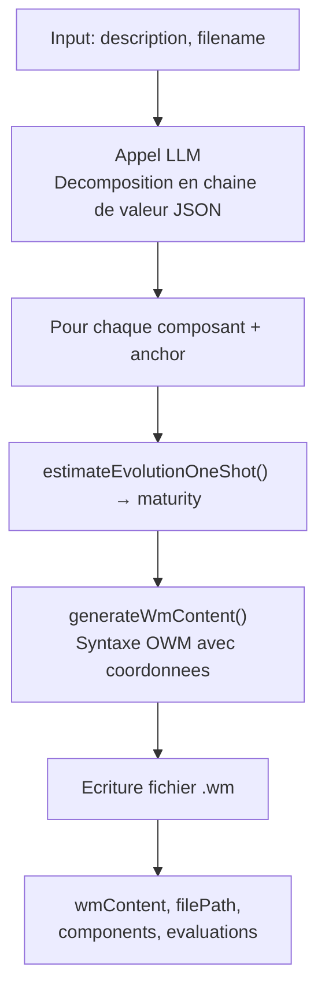

# Architecture

## Vue d'ensemble

WardleyAssistant est un serveur MCP implementant le protocole JSON-RPC 2.0 sur stdio. Il ne depend d'aucun framework externe pour le transport — le serveur lit stdin ligne par ligne et ecrit les reponses sur stdout.

## Pipeline de traitement

## TypeScript strict + Zod

Le projet est en **TypeScript strict** (`tsconfig.json` → `"strict": true`), extensions `.mts` (ESM strict). La chaine de build `tsc` compile `src/**/*.mts` vers `dist/**/*.mjs` + `dist/**/*.d.mts`.

**Zod est la source de verite unique** pour les schemas (voir [validation.md](validation.md) pour le detail) :
- `src/schemas/*.schema.mts` definissent les schemas Zod
- Le JSON Schema expose au client MCP est genere via `z.toJSONSchema(schema, { io: 'input' })`
- Les types TypeScript sont inferes via `z.infer<typeof Schema>`
- Les handlers appellent `Schema.parse(args)` pour valider a l'execution

Aucune duplication entre le JSON Schema MCP, les interfaces TS et la validation runtime.

## Modules par couche

### Transport MCP

| Module | Role |
|---|---|
| `src/mcp/mcp-server.mts` | Serveur JSON-RPC 2.0 stdio, registre de 5 outils, dispatch |
| `src/mcp/mcp-tool.mts` | Definition et handler de `estimateEvolution` |
| `src/work-on-evolution/evaluate-map/evaluate-map.mts` | Definition et handler de `evaluateMap` |
| `src/work-on-value-chain/generate-value-chain.mts` | Definition et handler de `generateValueChain` |
| `src/work-on-value-chain/identify-capability.mts` | Definition et handler de `identifyCapability` |
| `src/work-on-evolution/strategies/anchor/estimate-anchor-evolution.mts` | Definition et handler de `estimateAnchorEvolution` |

### Schemas (Zod)

| Module | Role |
|---|---|
| `src/schemas/estimate-evolution.schema.mts` | Schema Zod de `estimateEvolution` + type `EstimateEvolutionInput` |
| `src/schemas/generate-value-chain.schema.mts` | Schema Zod de `generateValueChain` |
| `src/schemas/evaluate-map.schema.mts` | Schema Zod de `evaluateMap` |
| `src/schemas/identify-capability.schema.mts` | Schema Zod de `identifyCapability` |
| `src/schemas/estimate-anchor-evolution.schema.mts` | Schema Zod de `estimateAnchorEvolution` |
| `src/schemas/patent.schema.mts` | `PatentDataSchema` + 8 sous-shapes (BigQuery / mock boundary) |
| `src/schemas/domain.schema.mts` | `ComponentInput`, `SolutionInput`, `EvolutionResult`, `PropertyEvaluation`, … |
| `src/schemas/parsed-llm.schema.mts` | Schemas de sortie des parsers LLM |

### Logique metier

| Module | Role |
|---|---|
| `src/work-on-evolution/routing/classification-gate.mts` | Gate fixe : mots-cles + signaux contextuels → espace economique |
| `src/work-on-evolution/routing/mode-router.mts` | Detection automatique du mode (oneshot/guided) + dispatch |
| `src/work-on-evolution/estimate-evolution.mts` | Orchestration oneshot : classification → strategies → formatage |
| `src/session/conversation-session.mts` | Machine a etats pour le mode guide (5 phases) |
| `src/work-on-evolution/skill-handler.mts` | Parsing de langage naturel → appels API structures |
| `src/work-on-value-chain/identify-capability.mts` | Decode les noms techniques (CRM → gestion relation client) via LLM |

### Routage Solution / Capability

| Module | Role |
|---|---|
| `src/work-on-evolution/routing/solution-capability-router.mts` | Detection du type de composant (solution vs capability) et dispatch |
| `src/work-on-evolution/routing/detect-solution.mts` | Heuristiques de nommage + fallback LLM (tiers 1 et 2) |
| `src/work-on-evolution/pipeline/dual-verification-orchestrator.mts` | Orchestration des 3 tiers de verification avec court-circuit |
| `src/work-on-evolution/routing/web-search-verification.mts` | Verification tier 3 via recherche web |
| `src/work-on-evolution/pipeline/signal-combiner.mts` | Fusion des signaux LLM + web search en verdict unique |
| `src/work-on-evolution/routing/eval-mode-dispatcher.mts` | Dispatch vers les registres de strategies selon le mode eval |

### Strategies Capability

| Module | Role |
|---|---|
| `src/work-on-evolution/strategies/capacity/registry.mts` | Auto-decouverte et cache des fichiers `*-strategy.mts` |
| `src/work-on-evolution/strategies/capacity/base-strategy.mts` | Interface abstraite (`evaluate()` + `validateResult()`) |
| `src/work-on-evolution/strategies/capacity/s-curve-strategy.mts` | Modele dual sigmoide (certitude × ubiquite) |
| `src/work-on-evolution/strategies/capacity/publication-analysis-strategy.mts` | Distribution wonder/build/operate/usage |
| `src/work-on-evolution/strategies/capacity/timeline-benchmark-strategy.mts` | Timeline historique recursive |
| `src/work-on-evolution/strategies/capacity/llm-direct-strategy.mts` | Estimation LLM directe (blend 70% s-curve + 30% LLM) |
| `src/work-on-evolution/strategies/capacity/logprob-distribution-strategy.mts` | Logprobs OpenCode → distribution de probabilite |
| `src/work-on-evolution/strategies/capacity/cpc-evolution-strategy.mts` | Brevets CPC via BigQuery (8 indicateurs certitude+ubiquite) |

### Strategies Solution

| Module | Role |
|---|---|
| `src/work-on-evolution/strategies/solution/registry.mts` | Auto-decouverte des fichiers `*-strategy.mts` dans `solution/` |
| `src/work-on-evolution/strategies/solution/solution-base-strategy.mts` | Classe abstraite solution (etend `BaseStrategy`) |
| `src/work-on-evolution/strategies/solution/properties-strategy.mts` | Evaluation des 12 proprietes Wardley (auto + conversationnel) |
| `src/work-on-evolution/strategies/solution/evolution-properties.json` | Reference : 12 proprietes × 4 phases avec descriptions |
| `src/work-on-evolution/strategies/solution/phase-classifier.mts` | Mapping propriete → phase (1-4) |
| `src/work-on-evolution/strategies/solution/aggregate-properties.mts` | Agregation ponderee des phases en evolution [0-1] |
| `src/work-on-evolution/strategies/solution/assemble-result.mts` | Enrichissement des resultats (stage, distribution, confiance) |
| `src/work-on-evolution/strategies/solution/solution-evolution-result.mts` | Modele de resultat solution avec validation |

### Mathematiques

| Module | Role |
|---|---|
| `src/work-on-evolution/s-curve/s-curve.mts` | Modele S-curve : sigmoide generalisee, bandes, zones, projection |
| `src/work-on-evolution/s-curve/s-curve-visualizer.html` | Visualiseur interactif HTML5 Canvas |

### Infrastructure LLM

| Module | Role |
|---|---|
| `src/lib/llm/llm-call.mts` | Interface multi-backend (Agent SDK + OpenCode) |
| `src/lib/llm/llm-error-handler.mts` | Classification d'erreurs (timeout, rate_limit, auth, etc.) |
| `src/lib/errors.mts` | Helpers `toErrorMessage`/`errorCode` pour narrowing sous `strict: true` |

### Notifications et i18n

| Module | Role |
|---|---|
| `src/lib/mcp-notifications.mts` | Emission JSON-RPC (channel + standard), gating verbose |
| `src/lib/progress-messages.mts` | Catalogue de messages localises (10 langues, 40+ messages) |
| `src/lib/language-detect.mts` | Detection de langue par heuristiques et empreintes |

### Formatage

| Module | Role |
|---|---|
| `src/lib/response-formatter.mts` | Resultat → markdown (stade, confiance, raisonnement par strategie) |

## Dual backend LLM

Le systeme supporte deux backends LLM, selectionnes automatiquement :

| Backend | Modele par defaut | Quand | Logprobs |
|---|---|---|---|
| **Claude Agent SDK** | `claude-sonnet-4-6` | Sous-processus MCP (Agent SDK spawne un child) | Non |
| **OpenCode API** | `kimi-k2.5` | Session interactive Claude Code | Oui |

**Pourquoi deux backends ?** Le Claude Agent SDK cree un sous-processus qui entre en conflit avec une session Claude Code active. Quand le serveur tourne dans Claude Code, il utilise OpenCode pour eviter ce conflit. La variable `_WARDLEY_NESTED` est positionnee automatiquement par le serveur au demarrage.

**Configuration** : Le modele est configurable via `WARDLEY_LLM_MODEL` (env var).

## Guard anti-recursion

Le serveur MCP positionne `_WARDLEY_NESTED=1` au demarrage. Si un processus enfant herite de cette variable et tente de demarrer un second serveur MCP, il quitte proprement sans erreur. Cela empeche le spawn infini quand l'Agent SDK re-invoque le MCP.

## Flux de donnees — estimateEvolution

### Detection solution vs capability — pipeline 3-tiers

Le routeur determine si un composant est une **solution nommee** (Kubernetes, Salesforce, SAP ERP) ou une **capability abstraite** (container orchestration, CRM, ERP). Le choix du pipeline d'evaluation en depend.

Le **Signal Combiner** fusionne les signaux LLM et web search en un verdict unique :
- Accord → bonus de confiance (+0.10)
- Desaccord → poids LLM (0.45) vs web search (0.55), penalite de confiance (-0.10)
- Signal manquant → degradation (×0.85)

## Flux de donnees — evaluateMap

## Flux de donnees — generateValueChain

