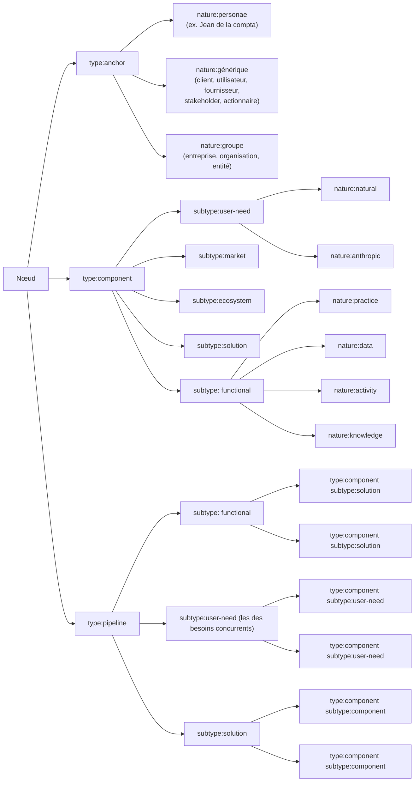
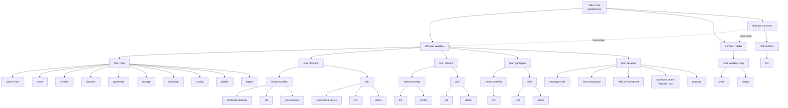

# [Documentation] — labre-mcp AST v0.1.0

Environnement: Production
Type: 📝 Documentation
Description: Document pivot opérationnel de l'AST labre-mcp — v0.1.0 (Wardley + OWM exhaustifs ; edgy / cynefin / common esquissés).
Priorité: 🔴 Haute
Statut: 🔄 En cours
Assigné à: Mathieu Jolly
Date d'échéance: 18 mai 2026
Epopée: [IA Wardley] — POC Wardley Maps dans un agent IA (https://www.notion.so/IA-Wardley-POC-Wardley-Maps-dans-un-agent-IA-31a4341bfd468045bc6cc5cd4878fed1?pvs=21)
Périmètre applicatif: Coach Mathieu - spécialiste des cartes de Wardley (https://www.notion.so/Coach-Mathieu-sp-cialiste-des-cartes-de-Wardley-31a4341bfd4680d5b10ce079bebf5563?pvs=21)

<aside>
🧬

**Document pivot opérationnel** de l'AST de **labre-mcp** — version **v0.1.0** (statut : `experimental`).
**Source / historique** : [[Documentation] — Wardley Maps AST](https://www.notion.so/Documentation-Wardley-Maps-AST-35d4341bfd468019b4e1ef5d074b8869?pvs=21).
**Plan de production** : [Fiche pivot labre-mcp AST](https://www.notion.so/Fiche-pivot-labre-mcp-AST-5e38fc01fd15487d8624975c4a1f419d?pvs=21).
**Propriétaire** : @Mathieu Jolly. **Échéance** : 18 mai 2026.

</aside>

<aside>
📐

**Grammaire canonique** : `domain:tool:sous-domaine:command:strategie@version`
**Séparateur** : `:` — **Commentaire** : `//` — **Stratégie canonique** : `default` est une stratégie comme une autre, présente au segment 5. Le wire format impose toujours **5 segments** ; `default` n'est jamais implicite — un appelant qui veut la stratégie par défaut écrit `:default` explicitement.
**Version** : `@x.y.z` SemVer triplet, optionnelle (dernière version stable si omise).
**Conventions** : identifiants techniques en **`kebab-case` anglais**, prose en **français**, JSON Schemas en **toggle** pour ne pas alourdir la lecture.

</aside>

<aside>
🧭

**Ce document fait foi.** Il supersede ou amende plusieurs ADR antérieurs ([decisions.md](decisions.md)) :

| ADR | Effet | Résumé |
| --- | --- | --- |
| ARCH-01 | Superseded | Wardley a 5 tools (`map`, `doctrine`, `climate`, `gameplay`, `iteration`) — `chain` devient sous-domaine de `map`, `evolution` devient sous-domaine de `map:climate`, `cycle` devient `iteration`. |
| ARCH-02 | Superseded | Scope v0.1.0 = Wardley exhaustif + `render` (OWM, image) + `common`. |
| ARCH-03 | Amended | 5 segments conservés mais ordre `domain:tool:sous-domaine:command:strategie` (segments 3 et 4 inversés). `default` canonique au segment 5. SemVer `@x.y.z`. |
| ARCH-04 | Superseded | Vocabulaire de commande **ouvert** (`generate`, `parse`, `emit`, `audit`, `identify`, `estimate`, `update`, etc.). `update` est autorisé en commande standalone, opérant sur le JSON métier. |
| ARCH-05 | Amended | Le schéma renderer (`wardley-map.schema.json`) est élevé au rang de **norme de communication** aux frontières. Le snapshot interne reste valide, l'anti-corruption layer vit dans `render`. |
| ARCH-06 | Amended | Recipes peuvent traverser plusieurs tools dans un même domain. |
| ARCH-10 | Amended | Listeners explicitement déclarés dans `recipe.listeners[step]`, plus implicites. Event-bus persiste comme transport sous-jacent. Listeners core (degradation, artifact-writer) inchangés. |
| ARCH-20 | Partiellement superseded | SemVer `@x.y.z` adopté dès v0.1.0 (per-AST + per-strategy). `cycle` → `iteration` en scope. Agent strategies toujours différées. |
| ARCH-07, 08, 09, 11–19, 21–24 | Conservés | Pas de contradiction. |

ARCH-25 (nouvel ADR) acte cette supersession. Voir [decisions.md § ARCH-25](decisions.md#arch-25--ast-schemamd-v010-is-the-new-pivot-grammar).

</aside>

---

# 1. Synthèse

## 1.1. Concepts

L'AST de labre-mcp est une **grammaire à 5 segments** (plus un suffixe de version) qui permet d'adresser de façon univoque toute capacité exposée par le MCP. Elle est conçue pour outiller des agents IA opérant sur des frameworks d'architecture et de stratégie : cartes de Wardley en premier lieu (edgy, archimate, cynefin plus tard), un domaine `render`, et un domaine transverse `common`.

### Les 5 segments

| Segment | Rôle | Exemples |
| --- | --- | --- |
| `domain` | Framework de rattachement. | `wardley`, `render`, `common` |
| `tool` | Outil métier dans le framework — produit ou processus de référence. | `map`, `doctrine`, `iteration`, `gameplay` , `climate`, `image` , `owm` |
| `sous-domaine` | Aspect de l'outil sur lequel porte la commande. | `value-chain`, `evolution`, `climate`, `doctrine-analysis`, `node`, `phase-assessment` , `pst` |
| `command` | Action canonique appliquée au sous-domaine. | `generate`, `parse`, `emit`, `audit`, `identify`, `estimate`, `explain`, `guide`, `next-step`, `score`, `recommend`, `compare`, `enrich`, `simulate`, `prevent-collision`, `classify`, `orchestrate`, `synthesize`, `present` , `inertia-analysis` |
| `strategie` | Variante d'implémentation de la commande. `:default` si omis. | `default`, `top-down`, `s-curve`, `llm-direct`, `ppt-deck`, `html-deck`, `readiness-radar`… |

### Règles structurantes

- **Wire format** : strict 5 segments, anchored regex `^[a-z][a-z0-9-]*(:[a-z][a-z0-9-]*){4}(@\d+\.\d+\.\d+)?$`. Aucun segment ne peut être omis sur le fil — y compris le segment 5 où `default` doit être écrit explicitement.
- **Stratégie `default`** : `default` est un identifiant de stratégie canonique au même titre que `top-down` ou `s-curve`. Chaque commande qui propose une stratégie par défaut publie une entrée `:default` dans son catalogue. Ex. : `wardley:map:value-chain:generate:default` pointe sur l'algorithme de référence ; `wardley:map:value-chain:generate:top-down` est une variante explicite.
- **Listing / introspection** : pas de wildcard sur le fil. La découverte des methodId disponibles se fait via la toolbox :
    
    ```json
    { "command": "common:toolbox:list:emit:default",
      "input":   { "prefix": "wardley:map:" } }
    ```
    
    Retourne tous les methodId dont l'identifiant commence par `prefix`. Permet l'introspection à n'importe quelle granularité (`wardley:`, `wardley:map:`, `wardley:map:value-chain:`, …) sans polluer la grammaire d'exécution avec des tokens spéciaux.
- **Version** : `@x.y.z` SemVer triplet. Si omis, la dernière version stable est résolue. Versionning per-AST **et** per-strategy (cf. § 3.2).
- **Alias inter-domaines** : **interdits en v0.1.0**. Les passerelles passent explicitement par `common`.
- **Round-trip OWM** : `parse → emit` idempotent à l'octet près sans transformation interposée. **Objectif v0.1.0** plus que invariant figé — toute violation est suivie comme un bug bloquant en § 3.2 gouvernance.

### Glossaire opérationnel

- **MCP** — *Model Context Protocol*. Serveur qui expose les outils consommés par les agents IA.
- **AST** — *Abstract Syntax Tree*. Arbre syntaxique décrivant la grammaire des commandes du MCP.
- **DSL** — *Domain Specific Language*. Langage dédié à un domaine (ici : OWM).
- **OWM** — *OnlineWardleyMaps*. DSL textuel de référence pour les cartes de Wardley.
- **Recipe** — Suite ordonnée de commandes orchestrée par labre-mcp pour traiter un cas d'usage de bout en bout. Voir § 1.3.
- **Listener** — Commande secondaire branchée sur un step de recipe pour produire un insight hors flux principal.
- **Stratégie** — Implémentation interchangeable d'une commande, sélectionnable explicitement (ex. `s-curve`) ou par défaut (`default`).
- **`anchor` / `component` / `pipeline`** — Trois types de nœuds dans une carte de Wardley (voir hiérarchie en § 2.2).

## 1.2. Liste de toutes les commandes

<aside>
🗂️

Listing **canonique** des commandes spécifiées en v0.1.0. La spécification complète (intention, prérequis, inputs/outputs, stratégies, exemples) figure dans le **§ 2 Détails**.

</aside>

### Domaine `common` (transverse)

- `common:toolbox:list:emit:default`
- `common:toolbox:wardley:json-boilerplate`

### Domaine `wardley` (exhaustif v0.1.0)

**`tool=map`**

- `wardley:map:basemap:generate:default`
- `wardley:map:config:x-axis:standard`
- `wardley:map:config:x-axis:custom`
- `wardley:map:config:y-axis:standard`
- `wardley:map:config:y-axis:custom`
- `wardley:map:value-chain:generate:default`
- `wardley:map:value-chain:generate:top-down`
- `wardley:map:value-chain:audit:default`
- `wardley:map:value-chain:organized-y-position:default`
- `wardley:map:value-chain:prevent-collision:default`
- `wardley:map:value-chain:read:pipeline-opportunity`
- `wardley:map:node:identify:default`
- `wardley:map:node:generate-pipeline-from-component:default`
- `wardley:map:node:generate-node-from-pipeline:default`
- `wardley:map:node:generate-pipeline:default`
- `wardley:map:node:identify-point-of-change:default`
- `wardley:map:node:classify-point-of-change:default`
- `wardley:map:node:identify-method:project-management`
- `wardley:map:node:identify-method:buy-policy`
- `wardley:map:climate:identify:default`
- `wardley:map:climate:identify-method-issues:default`
- `wardley:map:doctrine:orient-path-where-to-invest:default`
- `wardley:map:doctrine:identify-the-method:default`
- `wardley:map:output:read:where-to-invest`
- `wardley:map:output:update:default`
- `wardley:map:gameplay:recommend-strategy-over-the-map:default`
- `wardley:map:climate:inertia-identification:default`
- `wardley:map:climate:position-functional-in-evolution:s-curve`
- `wardley:map:climate:position-functional-in-evolution:llm-direct`
- `wardley:map:climate:position-functional-in-evolution:cpc-evolution`
- `wardley:map:climate:position-functional-in-evolution:logprob-distribution`
- `wardley:map:climate:position-functional-in-evolution:publication-analysis`
- `wardley:map:climate:position-functional-in-evolution:timeline-benchmark`
- `wardley:map:climate:position-solution-in-evolution:property-assessment`
- `wardley:map:climate:position-anchor-in-evolution:default`
- `wardley:map:climate:position-value-chain-in-evolution:default`
- `wardley:map:zonage:generate:pst-analysis`
- `wardley:map:zonage:generate:teams`
- `wardley:map:zonage:generate:coherent-cluster`
- `wardley:map:quality:audit:default`

**`tool=doctrine`**

- `wardley:doctrine:simon-wardley:doctrinal-analysis:default`
- `wardley:doctrine:simon-wardley:list:kanban-view-group-by-phase`
- `wardley:doctrine:simon-wardley:list:kanban-view`
- `wardley:doctrine:simon-wardley:list:list-view`
- `wardley:doctrine:wiki:list:phase-view`
- `wardley:doctrine:wiki:list:kanban-view`
- `wardley:doctrine:wiki:doctrinal-analysis:default`
- `wardley:doctrine:wiki:detail:wiki-url`
- `wardley:doctrine:simon-wardley:doctrinal-analysis:phase-assessment`
- `wardley:doctrine:simon-wardley:doctrinal-analysis:three-judgement-assessment`
- `wardley:doctrine:simon-wardley:pst-analysis:personal`
- `wardley:doctrine:simon-wardley:pst-analysis:organisation`

**`tool=climate`**

- `wardley:climate:simon-wardley:list:kanban-view`
- `wardley:climate:simon-wardley:list:list-view`
- `wardley:climate:wiki:list:list-view`
- `wardley:climate:wiki:list:kanban-view`
- `wardley:climate:wiki:detail:wiki-url`
- `wardley:climate:simon-wardley:inertia:inertia-analysis`
- `wardley:climate:simon-wardley:inertia:list`

**`tool=gameplay`**

- `wardley:gameplay:simon-wardley:list:list-view`
- `wardley:gameplay:wiki:list:list-view`
- `wardley:gameplay:wiki:detail:wiki-url`

**`tool=iteration`**

- `wardley:iteration:strategy-cycle:explain:default`
- `wardley:iteration:strategy-cycle:guide:default`
- `wardley:iteration:why-of-purpose:guide:default`
- `wardley:iteration:why-of-movement:guide:default`
    - “Why of movement” est le groupement des actions : (1), (2), (3) — l'action (4) est traitée hors cycle de la stratégie
- `wardley:iteration:observe:next-step:default` (1)
- `wardley:iteration:orient:next-step:default` (2)
- `wardley:iteration:decide:next-step:default` (3)
- `wardley:iteration:act:next-step:default` (4)
- `wardley:iteration:purpose:generate:default`
- `wardley:iteration:purpose:audit-purpose-quality:default`

### Domaine `render` (exhaustif v0.1.0) — `tool=wardley-map`

**sous-domaine `owm`**

- `render:wardley-map:owm:emit:dsl`
- `render:wardley-map:owm:parse:dsl`
- `render:wardley-map:owm:config:dsl`

**sous-domaine `image`**

- `render:wardley-map:image:parse:svg`
- `render:wardley-map:image:parse:png`
- `render:wardley-map:image:emit:svg`
- `render:wardley-map:image:emit:png`
- `render:wardley-map:image:config:svg`
- `render:wardley-map:image:config:png`

## 1.3. Cas d'études et recipes

Les **recipes** orchestrent plusieurs commandes pour répondre à un cas d'usage métier. Elles sont déclarées en JSON et embarquent optionnellement des **listeners** : des commandes secondaires branchées sur un step pour produire des insights hors du chemin nominal.

### Format canonique d'une recipe

- Schéma JSON
    
    ```json
    [
      {
        "name": "recipe-name",
        "path": {
          "step-1": "domain:tool:subdomain:command:strat@v",
          "step-2": "domain:tool:subdomain:command:strat@v",
          "step-3": "domain:tool:subdomain:command:strat@v"
        },
        "listeners": {
          "step-1": [
            "domain:tool:subdomain:command:strat@v",
            "domain:tool:subdomain:command:strat@v"
          ],
          "step-2": ["domain:tool:subdomain:command:strat@v"]
        }
      }
    ]
    ```
    

**Contrat des listeners** :

- Un listener est **idempotent** et **sans effet de bord** sur le path principal.
- Il consomme les **événements émis par son step parent** (entrée du step, sortie du step, métadonnées).
- Il émet des **insights** typés (`Insight { source, observation, severity, evidence }`) agrégés dans la sortie de la recipe.
- Un échec de listener n'interrompt **jamais** le path principal.

### Cas d'étude n°1 — *Inertie de Kodak*

**Cas** : projeter rétrospectivement l'inertie qui a empêché Kodak de basculer du film argentique vers le numérique alors que la technologie était identifiée en interne dès les années 1970.

**Recipe** :

```json
[
  {
    "name": "Wardley Maps + inertia",
    "path": {
	    "step-1": "common:toolbox:wardley:json-boilerplate:default",
      "step-2": "wardley:iteration:purpose:generate:default",
      "step-3": "wardley:map:value-chain:generate:top-down@0.1.0",
      "step-4": "wardley:map:climate:position-value-chain-in-evolution:default",
      "step-5": "wardley:map:climate:inertia-identification:default"
    },
    "listeners": {
      "step-2": ["wardley:iteration:purpose:audit-purpose-quality:default"],
      "step-4": [
        "wardley:map:quality:audit:default",
        "wardley:map:climate:identify:default"
      ],
      "step-5": [
        "wardley:map:doctrine:orient-path-where-to-invest:default",
        "wardley:climate:simon-wardley:inertia:inertia-analysis@0.1.0"
      ]
    }
  }
]
```

### Cas d'étude n°2 — *Produire la chaîne de valeur d’un acteur économique*

**Cas** : *Représenter la chaîne de valeur d’une organisation du point de vue de la RSE pour permettre une analyse des facteurs de risques des matières premières au consommateur final*

**Recipe** :

```json
[
  {
    "name": "produce a value chain",
    "path": {
      "step-1": "common:toolbox:wardley:json-boilerplate:default",
      "step-2": "wardley:iteration:purpose:generate:default",
      "step-3": "wardley:map:value-chain:generate:default",
      "step-4": "wardley:map:value-chain:organized-y-position:default",
      "step-5": "wardley:map:value-chain:prevent-collision:default"
    },
    "listeners": {
      "step-2": ["wardley:iteration:purpose:audit-purpose-quality:default"],
      "step-5": [
        "wardley:map:value-chain:audit:default",
        "wardley:map:zonage:generate:coherent-cluster"
      ]
    }
  }
]
```

---

# 2. Détails

## 2.0. Patron uniforme de description d'une commande

Chaque commande des § 2.1 à 2.3 suit **rigoureusement** ce patron. C'est un invariant **non négociable** pour la v0.1.0.

```markdown
### `domain:tool:sous-domaine:command:strategie`

**Intention** — phrase unique décrivant l'effet métier.
**Prérequis** — état attendu en amont.
**Inputs** — prose + JSON Schema (toggle).
**Outputs** — prose + JSON Schema (toggle).
**Stratégies disponibles** — tableau (stratégie / quand / coût / confiance).
**Exemple d'appel** — bloc code.
```

### JSON Schema racine commun

Toutes les commandes héritent d'une enveloppe d'appel et de réponse standardisée.

- JSON Schema — enveloppe d'appel `CommandCall`
    
    ```json
    {
      "$schema": "https://json-schema.org/draft/2020-12/schema",
      "$id": "labre-mcp/core/CommandCall.schema.json",
      "type": "object",
      "required": ["command", "input"],
      "properties": {
        "command": {
          "type": "string",
          "pattern": "^[a-z][a-z0-9-]*(:[a-z][a-z0-9-]*){4}(@\\d+\\.\\d+\\.\\d+)?$"
        },
        "input": { "type": "object" },
        "metadata": {
          "type": "object",
          "properties": {
            "requestId": { "type": "string", "format": "uuid" },
            "requestedAt": { "type": "string", "format": "date-time" },
            "callerAgent": { "type": "string" }
          }
        }
      }
    }
    ```
    
- JSON Schema — enveloppe de réponse `CommandResult`
    
    ```json
    {
      "$schema": "https://json-schema.org/draft/2020-12/schema",
      "$id": "labre-mcp/core/CommandResult.schema.json",
      "type": "object",
      "required": ["command", "status", "output"],
      "properties": {
        "command": { "type": "string" },
        "status": { "enum": ["ok", "partial", "error"] },
        "output": { "type": "object" },
        "warnings": { "type": "array", "items": { "type": "string" } },
        "errors": { "type": "array", "items": { "type": "string" } },
        "metadata": {
          "type": "object",
          "properties": {
            "durationMs": { "type": "integer" },
            "strategyUsed": { "type": "string" },
            "versionUsed": { "type": "string" }
          }
        }
      }
    }
    ```
    

### Format canonique `JSON-labre`

L'artefact transversal qui circule entre les commandes de labre-mcp s'appelle **`JSON-labre`**. Il associe **une partie métier par domaine** (validable par son propre schéma JSON) à **une enveloppe transverse** (conversationnelle, traçabilité, ARCH-22).

```json
{
  "$schema":  "labre-mcp/core/JsonLabre.schema.json",
  "version":  "0.1.0",
  "wardley": {
    "map":       { /* conforme wardley-map.schema.json (renderer) */ },
    "doctrine":  { /* DoctrinalAnalysis | catalogue */ },
    "climate":   { /* Climate | InertiaAnalysis | catalogue */ },
    "gameplay":  { /* StrategyOnMap | catalogue */ },
    "iteration": { /* Context + état du cycle */ }
  },
  "envelope": {
    "context":    { "purpose", "scope", "angle", "temporality", "granularity", "deliverables" },
    "signals":    [ /* ARCH-22 — preuves consommées en entrée */ ],
    "reasoning":  [ /* ARCH-22 — trace LLM verbatim */ ],
    "insights":   [ /* ARCH-22 + listeners — interprétations produites */ ],
    "trace":      [ { "command", "version", "strategyUsed", "params", "durationMs" } ],
    "references": [ { "artifactPath", "jsonPath" } ]
  }
}
```

Principes :
- Chaque sous-arbre `wardley.<tool>` est **optionnel** — n'apparaît que si la commande qui l'alimente a été exécutée.
- Chaque sous-arbre `wardley.<tool>` se conforme à **son propre schéma métier**. Pour `wardley.map`, c'est le schéma renderer (cf. ci-dessous).
- L'`envelope` agrège tout ce qui est conversationnel et traçable. Elle est **append-only** dans la durée d'une recette : chaque commande ajoute ses entrées, aucune n'efface celles des précédentes.
- `references[]` reprend la structure `AnalysisRef` (ARCH-24) pour pointer vers des artefacts détaillés (ex. un `WardleyEvolutionAST` complet).

#### Norme de communication — `wardley-map.schema.json`

<aside>
📐

La forme canonique d'une carte de Wardley dans `wardley.map` est **strictement celle du schéma renderer** (`wardley-map.schema.json`, `$id` = `https://wardley-map-renderer/schema/wardley-map.schema.json`). Ce schéma fait foi pour tous les inputs/outputs du tool `map` à la **frontière** des commandes, et constitue la norme de communication entre l'agent et le moteur de rendu.

</aside>

Les types `Component`, `EvolutionPosition`, `ValueChain`, `Map` ne sont **pas redéfinis ici** : ils dérivent intégralement du schéma renderer. Le **modèle interne** d'une stratégie peut être plus riche (ARCH-05 amendé) ; la frontière I/O doit conformer au schéma renderer.

#### Anti-corruption layer

Le domaine `render` (§ 2.3) joue le rôle d'**anti-corruption layer** entre les modèles internes enrichis et le schéma renderer canonique. Lorsqu'une commande produit naturellement des objets enrichis (champs propres à la stratégie, métadonnées d'incertitude, etc.), une étape d'**ETL** projette ces objets vers le format renderer en :

- conservant les champs reconnus par le schéma ;
- déplaçant les champs analytiques (`signals`, `reasoning`, `insights`, `trace`) vers l'`envelope` ;
- déplaçant les champs métier per-élément (justification narrative attachée à un composant, incertitude sur sa position) vers le **JSON métier** (ex. `Component.rationale`, `EvolutionField.range`) ;
- normalisant les IDs et les références.

#### Frontière `envelope` vs JSON métier

Pour éviter les chevauchements, la règle est :

| Catégorie | Où ça vit | Exemples |
| --- | --- | --- |
| **Donnée attachée à un objet précis** (composant, doctrine, gameplay, …) | JSON métier | `Component.rationale` (justification de positionnement), `EvolutionField.range` (incertitude), `EvolutionField.confidence` (confiance per-élément), `Component.method.preconisation` |
| **Donnée transverse à toute l'étude** | `envelope` | `context` (purpose/scope/angle), `trace[]` (audit d'exécution), `references[]` (cross-AST) |
| **Chaîne analytique de chaque commande** (ARCH-22) | `envelope` | `signals[]`, `reasoning[]`, `insights[]` |

**`signals[]` vs `insights[]`** — sémantique opposée, à ne pas fusionner :
- `signals[]` = preuves **consommées en entrée** par la stratégie (`{ name: "certitude", value: 0.9, source: "user-input" }`).
- `insights[]` = interprétations **produites en sortie**, au-delà du résultat canonique (`{ text: "convergence en phase product confirmée par 3 stratégies", by: methodId, type: "trajectory" }`).

#### Labels d'affichage `stage`

Les libellés `genesis | custom | product | commodity` sont des **labels d'affichage** que les commandes peuvent émettre pour la communication utilisateur (axes, légendes, texte d'insight). Ils ne sont **jamais** utilisés comme clés de routage, de distribution ou de partitionnement dans le code — un partitionnement par phase utilise des clés génériques (`phase1..phase4`) et associe les labels d'affichage à la frontière de présentation.

#### Politique d'IDs

Le schéma renderer impose un `id` sur chaque `Component` et chaque `Relation`. La spécification de l'AST se contente d'**indiquer le besoin d'ID** : la stratégie de génération (UUID, slug, monotone, etc.) est tranchée en phase d'implémentation. La règle d'architecture est qu'un agent ne crée jamais un objet sans `id` exploitable par les commandes ultérieures (notamment `wardley:map:output:update:default`).

#### Nommage des relations — `consumer` / `supplier`

Le schéma renderer actuel utilise `source` / `target` (et `from` / `to`). Le moteur de rendu évolue pour intégrer le couple **`consumer` / `supplier`**, plus aligné sur le vocabulaire Wardley (un consommateur dépend de son fournisseur). La convention dans toute la documentation labre-mcp est de raisonner en termes **consumer → supplier** ; l'adaptation au schéma renderer se fait à la frontière par l'anti-corruption layer.

#### Métadonnées de stratégie

Chaque stratégie publie un **JSON Schema de métadonnées** (en plus de son schéma I/O) qui décrit ses caractéristiques opérationnelles. Voir l'annexe § 3.4 — Contrat de strategy v0.2 — pour le schéma complet.

---

## 2.1. Domaine `common` (transverse)

Domaine **transverse** qui héberge les commandes utiles à plusieurs frameworks (toolbox, rapports, présentation, orchestration). Toute **passerelle inter-domaines** doit transiter par `common` plutôt que via un alias direct.

### 2.1.1. `Tool=toolbox`

#### `common:toolbox:list:emit:default`

**Intention** — Lister tous les outils exposés par labre-mcp, regroupés par domaine.
**Prérequis** — Aucun.
**Inputs** — Filtres optionnels par domaine ou tool.
**Outputs** — Catalogue structuré des commandes disponibles avec leur version courante.

#### `common:toolbox:wardley:json-boilerplate:default`

**Intention** — Fournir au MCP le **squelette JSON canonique** d'une étude de Wardley, prêt à être transmis aux autres outils qui manipulent le standard. Le boilerplate sert d'**ancrage structurel** : il garantit que la forme attendue est connue avant tout appel produisant ou consommant une `Map`.
**Structure en deux parties**  :

1. **Partie métier (domain-specific Wardley)** — Notamment conforme au schéma renderer (`wardley-map.schema.json`, cf. § 2.0) : `title`, `components`, `relations`, `accelerators`, `steps`, mais aussi conforme au autres outils du domaine Wardley. Compréhensible uniquement par les outils du domaine `wardley` et par `render:wardley-map`.
2. **Partie transverse (cross-domain envelope)** — Champs hors-rendu partagés par l'ensemble des outils du MCP (cf. tableau « Champs hors-rendu » du § 2.0) : `confidence`, `rationale`, `range`, `Insight[]`, `trace`, `context`. Réutilisable par les autres domaines (`edgy`, `cynefin`…) et par les listeners de recipes.

**Prérequis** — Aucun.

**Inputs** — Aucun c’est juste un get

**Outputs** — Objet JSON conforme à l'enveloppe canonique `JSON-labre` (cf. § 2.0) :

```json
{
  "$schema":  "labre-mcp/core/JsonLabre.schema.json",
  "version":  "0.1.0",
  "wardley":  { "map": {...}, "doctrine": {...}, "climate": {...}, "gameplay": {...}, "iteration": {...} },
  "envelope": { "context": {}, "signals": [], "reasoning": [], "insights": [], "trace": [], "references": [] }
}
```

La partie `wardley.map` est strictement validable par le schéma renderer ; les autres sous-arbres `wardley.*` sont validés par leur schéma métier respectif. L'`envelope` est optionnelle dans son contenu mais sa **structure** (présence des 6 clés) est obligatoire pour rester compatible avec les listeners.

---

## 2.2. Domaine `wardley`

Domaine **exhaustif** en v0.1.0. Cinq outils sont couverts : `map`, `doctrine`, `climate`, `gameplay`, `iteration`.

### 2.2.1. `tool=map`

L'outil **central** du domaine. Couvre toute la chaîne de production d'une carte : configuration des axes, fond de carte, chaîne de valeur, nœuds, climats (avec inertie et positionnement en évolution), doctrine, gameplay, zonage PST, lecture (output) et qualité.

#### `wardley:map:basemap:generate:default`

**Intention** — Générer le fond de carte (titre, sous-titre, axes, légende par défaut, métadonnées de contexte / temporalité / angle / scope) à partir d'un prompt contextuel.
**Prérequis** — `Context` formulé (voir `wardley:iteration:purpose:generate:default`).
**Inputs** — `Context` structuré.
**Outputs** — `Map` (sans `valueChain` peuplée).

#### `wardley:map:config:x-axis:standard`

**Intention** — Configurer l'axe X (évolution) : affichage, libellé d'axe, phases, possibilités de localisation (en/fr) : 

- show axis : true
- showcolumn : true
- libellé colonne 1 : en=“genesis”, fr=”genèse”
- libellé colonne 2 : en=“custom”, fr=”sur-mesure”
- libellé colonne 3 : en=“product (+rental)”, fr=”produit (+location)”
- libellé colonne 4 : en=“commodity (+utility)”, fr=”commodité (+utilitaire)”
- nom de l’axe : en=“evolution”, fr=”évolution”

**Prérequis** — `Map`.
**Inputs** — language “en”, “fr”.
**Outputs** — Configuration d'axe normalisée intégrée dans le `Map`.

#### `wardley:map:config:x-axis:custom`

**Intention** — Configurer de manière customisée l'axe X (évolution) : affichage, libellé d'axe, phases : 

- show axis : boolean
- show column : boolean
- libellé colonne 1 : string
- libellé colonne 2 : string
- libellé colonne 3 : string
- libellé colonne 4 : string
- nom de l’axe : string

**Prérequis** — `Map`.
**Inputs** — JSON avec les valeurs customs pour chaque paramètre show-axis, show-column, column-1-label, column-2-label, column-3-label, column-4-label
**Outputs** — Configuration d'axe normalisée intégrée dans le `Map`.

#### `wardley:map:config:y-axis:standard`

**Intention** — Configurer l'axe Y (visibilité / chaîne de valeur) : affichage, libellé central, libellés haut/bas, configuration par défaut multilingue dans sa configuration standard comme montrée ci-après :

- show : true
- libellé central : en=“value chaine”, fr=”chaine de valeur”
- libellé haut : en=“visible”, fr=”visible”
- libellé bas : en=“invisible”, fr=”invisible”

**Prérequis** — `Map`.
**Inputs** — language “en”, “fr”.
**Outputs** — Configuration d'axe normalisée intégrée dans le `Map`.

#### `wardley:map:config:y-axis:custom`

**Intention** — Configurer de manière customisé l'axe Y (visibilité / chaîne de valeur) : affichage, libellé central.

**Prérequis** — `Map`.
**Inputs** — JSON avec les valeurs customs pour chaque paramètre show, central-label, top-label et bottom-label
**Outputs** — Configuration d'axe customisée intégrée dans le `Map`.

#### `wardley:map:value-chain:generate:default`

**Intention** — Générer une chaîne de valeur à partir d'un prompt contextuel.
**Prérequis** — Contexte posé (voir `wardley:iteration:purpose:generate:default`).
**Inputs** — `prompt` (string)
**Outputs** — `ValueChain` 
**Stratégies** — `default` = `top-down` (part des ancres et descend).

#### `wardley:map:value-chain:generate:top-down`

**Intention** — Variante top-down : commence par les ancres et déroule besoins puis fonctions support.
**Prérequis / Inputs / Outputs** — Identiques à `:default`.
**Exemple** — `wardley:map:value-chain:generate:top-down@0.1.0` avec `{ prompt: "Marché de la déclaration CSRD pour ETI"}`.

#### `wardley:map:value-chain:audit:default`

**Intention** — Auditer une chaîne de valeur existante (cohérence des dépendances, orientation client→fournisseur descendante, absence de boucles, convention de nommage, qualité du contexte (temporalité, scope, angle, objectif)).
**Inputs** — `valueChain`.
**Outputs** — `score` qui résume la qualité de la carte, et `Insight[]`pour donner les foyers d’amélioration de la carte.

#### `wardley:map:value-chain:organized-y-position:default`

**Intention** — Optimiser les positions verticales dans un voisinage local pour maximiser la clarté sans modifier le sens (un fournisseur reste sous son consommateur).
**Prérequis** — `Map` chargée.
**Inputs** — `Map`.
**Outputs** — `Map`.

#### `wardley:map:value-chain:prevent-collision:default`

**Intention** — Repositionner les nœuds et les libellés des composants,  pour éviter superposition / collision avec d'autres labels, nœuds et liens.
**Prérequis** — `Map` chargée.
**Inputs** — `Map`.
**Outputs** — `Map` (offsets de labels mis à jour).

#### `wardley:map:value-chain:read:pipeline-opportunity`

**Intention** — Lis la chaîne de valeur et propose des endroits où transformer des nœuds en pipeline.
**Prérequis** — `Map` complète dont les composants sont positionnées dans l’évolution
**Inputs** — `Map`.
**Outputs** — `Insights`.

#### `wardley:map:node:identify:default`

**Intention** — Identifier le type (`anchor` / `component` / `pipeline`) et la nature d'un nœud brut.
**Inputs** — `node` (texte ou objet partiel).
**Outputs** — `Component` complété.

Voici le méta modèle de la nature des nœuds en fonction des types et sous-types de nœuds. Les types et sous-types symbolisent des frontières de représentation des nœuds différentes alors que la nature traduit des caractéristiques qui ne sont pas symbolisée directement dans une carte de Wardley. Il se peut que la nature du nœud soit précisé directement dans le label ou via une convention de nommage. 



<aside>
⚠️

Un pipeline est aussi flexible. Le métamodèle n’est pas obligatoirement respecté. Il indique une norme de qualité.

</aside>

#### `wardley:map:node:generate-pipeline-from-component:default`

**Intention** — Promouvoir un composant en **pipeline** : en fonction du type et de la nature de composant en input alors il faut produire la poignée du pipeline qui porte le sous-type du composant originel et intégrer au pipeline à minima deux nœuds de type composant et de sous-type cohérent avec le type de la poignée. Ces deux noeuds constitueront la liste de choix. 
**Prérequis** — Node de type `component` identifié dans la `Map`.
**Inputs** — `componentId` + `Map`.
**Outputs** — `Map` enrichie d'un pipeline (nœud parent + enfants typés `function` / `user-need` / `solution`).

#### `wardley:map:node:generate-node-from-pipeline:default`

**Intention** — Condenser un pipeline en un **composant** unique (zoom-out / synthèse). Le noeud composant hérite de toutes les caractéristiques de la poignée du pipeline. 
**Prérequis** — `Pipeline` existant dans la `Map`.
**Inputs** — `pipelineId` + `Map`.
**Outputs** — `Map` avec composant condensé, liens externes conservés.

#### `wardley:map:node:generate-pipeline:default`

**Intention** — Générer un pipeline complet (poignée label + poignée position x + poignée position y, border-left-x-position, border-right-x-position, border-top-y-position, border-bottom-y-position,  component 1 label, component 1 position, component 2 label, component 2 position)
**Prérequis** — Map.
**Inputs** — Prompt (contexte + commande)
**Outputs** — Pipeline

#### `wardley:map:node:identify-point-of-change:default`

**Intention** — Identifier, pour les composants étudiés, les **points de changement** (`evolveTo`) ainsi que leur `evolveType`. Une `evolveTo` marque une transition d'un composant vers une autre position dans l'évolution. L’approche est différente si c’est un composant de sous-type solution ou ci c’est une fonction
**Prérequis** — `Map` avec composants positionnés dans l'évolution + contexte temporel ou climats identifiés.
**Inputs** — `Map` + sous-ensemble de composants ciblés (optionnel).
**Outputs** — `[ { componentId, evolveTo, evolveType, confidence, rationale } ]` à appliquer ensuite sur la `Map` via `wardley:map:output:update:default`.

#### `wardley:map:node:classify-point-of-change:default`

**Intention** — Classifier un point de changement déjà identifié : attribuer un `evolveType` ∈ `{ natural, ecosystem, forced, late }` à une `evolveTo` existante. Utile en complément de `identify-point-of-change` ou quand l'`evolveTo` est posée manuellement sans qualification.
**Prérequis** — `Component` avec `evolveTo` renseignée.
**Inputs** — `componentId` + `Map` (ou `evolveTo` isolée + contexte).
**Outputs** — `{ componentId, evolveType, confidence, rationale }`.

#### `wardley:map:node:identify-method:project-management`

**Intention** — Identifier la **méthode de gestion de projet** appropriée pour un composant (`agile`, `lean`, `six-sigma`) en fonction de sa position dans l'évolution et de son `evolveType`. Permet d'apposer un décorateur de méthode sur le composant pour communiquer dessus à l'écran.
**Prérequis** — `Component` positionné dans l'évolution (idéalement avec `evolveTo`).
**Inputs** — `componentId` + `Map`.
**Outputs** — `{ componentId, method: { type: "project-management", preconisation: "agile" | "lean" | "six-sigma", rationale } }` (aligné sur `Component.method` du schéma renderer).

#### `wardley:map:node:identify-method:buy-policy`

**Intention** — Identifier la **politique d'acquisition** appropriée pour un composant (`build`, `buy`, `outsource`) en fonction de sa position dans l'évolution. Écho aux doctrines « Use appropriate methods » et « Use appropriate tools ».
**Prérequis** — `Component` positionné dans l'évolution.
**Inputs** — `componentId` + `Map`.
**Outputs** — `{ componentId, method: { type: "buy-policy", preconisation: "build" | "buy" | "outsource", rationale } }`.

#### `wardley:map:climate:identify:default`

**Intention** — Identifier les schémas climatiques pertinents pour la carte (cf. [Climatic patterns](https://www.notion.so/ec9d7711c45f4e09a3cc29ecb8587b51?pvs=21)).
**Inputs** — `Map`.
**Outputs** — Liste de `Climate` impliqués avec l’argumentation. Modification de la `Map` pour indiquer les impacts des climats sur la chaîne de valeur.

#### `wardley:map:climate:identify-method-issues:default`

**Intention** — Détecter, à l'échelle de la carte, la pertinence du climat « **il n'y a pas de méthode unique** » : signaler les cas où une méthode unique est appliquée uniformément alors que des composants relèvent de phases d'évolution différentes (donc de méthodes différentes).
**Prérequis** — `Map` avec composants positionnés dans l'évolution + idéalement décorateurs de méthode posés (cf. `wardley:map:node:identify-method:*`).
**Inputs** — `Map`.
**Outputs** — `Insight[]` ciblant les zones d'incohérence méthode/phase + recommandation de différenciation.

#### `wardley:map:climate:inertia-identification:default`

**Intention** — Repérer les **manifestations d'inertie** sur la carte (flèche point de changement qui change de phase d’évolution = inertie).
**Prérequis** — `Map` avec au moins une flèche de points de changement renseignée.
**Inputs** — `Map`.
**Outputs** — liste des flèches marquées. **Approfondissement** via `wardley:climate:simon-wardley:inertia:inertia-analysis` (§ 2.2.3).

#### `wardley:map:climate:position-functional-in-evolution:s-curve`

**Intention** — Positionner un besoin fonctionnel dans l’évolution via l’indication de la certitude et de l’ubiquité comme paramètre d’entrée pour la courbe en S.
**Prérequis** — Données temporelles ou proxys (publications, adoption).
**Inputs** — `node` (type = component, subtype = functional) + `context`
**Outputs** — `EvolutionPosition` avec `confidence.`

#### `wardley:map:climate:position-functional-in-evolution:llm-direct`

**Intention** — Positionnement d'un besoin fonctionnel par estimation LLM directement.
**Inputs** — `node` (type = component, subtype = function) + `context`
**Outputs** — `EvolutionPosition` avec `confidence.`

#### `wardley:map:climate:position-functional-in-evolution:cpc-evolution`

**Intention** — Positionnement d’un besoin fonctionnel par analyse des classes de brevets.
**Inputs** — functional + accès données via big query.
**Outputs** — `EvolutionPosition` avec `confidence.`

#### `wardley:map:climate:position-functional-in-evolution:logprob-distribution`

**Intention** — Positionnement d’un besoin fonctionnel par analyse de la distribution des log-probabilités d'un LLM (proxy de familiarité modèle → maturité).
**Inputs** — functional + `model`.
**Outputs** — `EvolutionPosition` avec `confidence.`

#### `wardley:map:climate:position-functional-in-evolution:publication-analysis`

**Intention** — Positionnement d’un besoin fonctionnel par analyse du volume et de la nature des publications scientifiques sur le sujet donné dans la temporalité indiqué.
**Inputs** — functional + année d’étude.
**Outputs** — `EvolutionPosition` + courbe de publication.

#### `wardley:map:climate:position-functional-in-evolution:timeline-benchmark`

**Intention** — Positionnement d’un besoin fonctionnel par reconstitution de la frise chronologique de l’enchainement des innovations qui répondent au besoin fonctionnel
**Inputs** — functional + `referenceSet` + `confidence`
**Outputs** — `EvolutionPosition`.

#### `wardley:map:climate:position-solution-in-evolution:property-assessment`

**Intention** — Positionner une **solution** dans l’évolution via analyse des propriétés (standardisation, cf. [Caractéristiques et propriétés de composant dans l’évolution de Wardley (digital)](https://www.notion.so/Caract-ristiques-et-propri-t-s-de-composant-dans-l-volution-de-Wardley-digital-15245278a05b4d3587513ebc0d86f548?pvs=21)).
**Inputs** — `solution`
**Outputs** — `EvolutionPosition` + `confidence`

#### `wardley:map:climate:position-anchor-in-evolution:default`

**Intention** — Positionner une **ancre** (persona, groupe, besoin générique). Les ancres restent stockées dans le tableau `components[]` du schéma renderer (avec `type: "anchor"`), mais le modèle d'évolution ne s'applique à elles que de manière **détournée** : leur `position.evolution` peut être laissée à la valeur conventionnelle de leur statut d'ancre, ou estimée par cette commande à partir du contexte (persona junior vs senior, organisation start-up vs incumbent, etc.). La sortie reflète cette nature : un `EvolutionPosition` est produit, mais sa sémantique est documentaire plus que prédictive.
**Inputs** — `anchor` + `context`.
**Outputs** — `EvolutionPosition` (sémantique documentaire) + `confidence` per-élément.

#### `wardley:map:climate:position-value-chain-in-evolution:default`

**Intention** — Positionner **l'intégralité d'une chaîne de valeur** dans l’évolution (opération de masse, plus efficiente qu'un appel par nœud).
**Prérequis** — `valueChain` saturée avec des positions préconfigurées, mais n’ayant peut-être aucune valeur. 
**Inputs** — `valueChain` + `context` optionnel.
**Outputs** — `valueChain` enrichie d'`EvolutionPosition` par nœud + agrégat de confiance.

#### `wardley:map:doctrine:orient-path-where-to-invest:default`

**Intention** — Dériver le **chemin doctrinal** qui oriente la réflexion sur les zones de la carte où investir.
**Prérequis** — `Map` avec évolution et climats.
**Inputs** — `Map` + `OrganizationContext` optionnel.
**Outputs** — `OrientPath` : suite ordonnée de doctrines à activer (Focus on user needs → Know your users → Use a common language → …) avec nœuds cibles annotés.
**Évolution** — Remplace l'ancien `wardley:map:doctrine:audit:default`.

#### `wardley:map:doctrine:identify-the-method:default`

**Intention** — Conseiller, à l'échelle de la carte, les **méthodes et outils appropriés par phase d'évolution**, en écho aux doctrines « Use appropriate methods (e.g. agile vs lean vs six-sigma) » et « Use appropriate tools (mapping, accounting, modelling) ». Sortie de niveau doctrinal qui orchestre les recommandations produites par `wardley:map:node:identify-method:*`.
**Prérequis** — `Map` avec composants positionnés dans l'évolution.
**Inputs** — `Map` + `scope` optionnel (sous-ensemble de composants).
**Outputs** — `MethodGuidance` : `[ { phase, recommendedMethods, recommendedTools, applicableComponents, rationale } ]`.

#### `wardley:map:output:read:where-to-invest`

**Intention** — À partir d'une carte avec chaîne de valeur complète et climats identifiés, repérer les **opportunités d'investissement**.
**Prérequis** — `Map` (avec `climates` et évolution).
**Inputs** — `Map`.
**Outputs** — Liste d'opportunités (nœud cible, mouvement recommandé, rationnel, climats activés).

#### `wardley:map:output:update:default`

**Intention** — **Write-gateway canonique** de la carte. Applique un patch (création / mise à jour / suppression de composants, relations, `method`, `evolveTo`, décorateurs) sur une `Map` existante en respectant strictement le schéma renderer. Toute mutation produite par les autres commandes (`identify-point-of-change`, `identify-method`, `identify-the-method`, `climate:identify`, `gameplay:recommend-strategy-over-the-map`…) transite par cette commande pour être inscrite dans la `Map`.
**Prérequis** — `Map` valide + patch conforme au schéma renderer.
**Inputs** — `Map` + `patch` (opérations d'écriture indexées par `id`).
**Outputs** — `Map` mise à jour + `trace` (opérations effectivement appliquées, conflits, rejets éventuels).

#### `wardley:map:gameplay:recommend-strategy-over-the-map:default`

**Intention** — Recommander des **gameplays projetés sur la carte** (mouvements concrets, nœuds visés, ordre d'exécution). Sortie plus riche que le simple listing : c'est une **stratégie spatialisée**.
**Prérequis** — `Map` saturée (chaîne de valeur + évolution + climats).
**Inputs** — `Map` + `objective`.
**Outputs** — `StrategyOnMap` : séquence ordonnée de `{ gameplay, targetNode, expectedMove, rationale }`.
**Évolution** — Remplace l'ancien `wardley:map:gameplay:recommend:default`.

#### `wardley:map:zonage:generate:pst-analysis`

**Intention** — Projeter le tryptique **Pioneer / Settler / Town Planner** sur la chaîne de valeur de la carte.
**Prérequis** — `Map` avec évolution renseignée.
**Inputs** — `Map`.
**Outputs** — `Map` enrichie d'un `pst` par nœud (`pioneer` | `settler` | `town-planner`) + zones regroupant les nœuds de même profil.

#### `wardley:map:zonage:generate:teams`

**Intention** — Générer une **proposition d'équipes** à partir du zonage PST : une équipe par zone cohérente, avec périmètre fonctionnel et profil dominant.
**Prérequis** — `Map` avec zonage PST appliqué.
**Inputs** — `Map` + contraintes RH optionnelles (taille équipe, compétences requises).
**Outputs** — `Team[]` (nom, composants couverts, profil PST dominant, compétences clés).

#### `wardley:map:zonage:generate:coherent-cluster`

**Intention** — Générer des **clusters fonctionnellement cohérents** à partir de la carte (regroupements par chaînes de dépendances proches, sans forcément passer par PST).
**Prérequis** — `Map` saturée.
**Inputs** — `Map` + `cohesionCriteria` (proximité évolutive, type fonctionnel, fréquence de couplage).
**Outputs** — `Cluster[]` (id, nœuds, critère de cohésion, métriques de couplage interne / externe).

#### `wardley:map:quality:audit:default`

**Intention** — Détecter les écarts aux pratiques standard d'une carte (titre manquant, contexte manquant, flèche de changement inversée, fournisseur positionné au-dessus du consommateur, etc.).
**Inputs** — `Map`.
**Outputs** — `Insight[]`.

### 2.2.2. `tool=doctrine`

Famille d'études centrée sur les **doctrines**. Le tool est partitionné en deux **sous-domaines de périmètre** :

- `simon-wardley` — référentiel **canonique** original de Simon Wardley.
- `wiki` — catalogue **élargi** : doctrines originales de Wardley + doctrines personnelles de Jolly + apports communautaires.

Pour chaque périmètre, on retrouve quatre familles de commandes : `doctrinal-analysis` (analyse), `list` (catalogage selon plusieurs vues de présentation), `detail` (zoom sur une entrée — exposé côté `wiki` uniquement), `pst` (analyse PST — exposé côté `simon-wardley` uniquement).

#### `wardley:doctrine:simon-wardley:doctrinal-analysis:default`

**Intention** — Conduire une **analyse doctrinale** générale d'une organisation contre le référentiel canonique de Simon Wardley : inventaire des doctrines applicables, niveau d'application, doctrines manquantes critiques.
**Prérequis** — `OrganizationContext` documenté.
**Inputs** — `OrganizationContext` + `Map` optionnelle.
**Outputs** — `DoctrinalAnalysis` (inventaire, scores, recommandations).

#### `wardley:doctrine:simon-wardley:doctrinal-analysis:phase-assessment`

**Intention** — Scorer la maturité d'application des doctrines canoniques **par phase** (I à IV).
**Prérequis** — `OrganizationContext` documenté.
**Inputs** — `Map` + `OrganizationContext`.
**Outputs** — `{ phaseI: 0..1, phaseII: 0..1, phaseIII: 0..1, phaseIV: 0..1 }` + détail par doctrine + score agrégé.

#### `wardley:doctrine:simon-wardley:doctrinal-analysis:three-judgement-assessment`

**Intention** — Analyse doctrinale par **trois jugements** sur le référentiel canonique : universel (vs référentiel Wardley), contextuel (vs contexte de l'organisation), opérationnel (vs capacité d'exécution actuelle).
**Prérequis** — `OrganizationContext` + `Map`.
**Inputs** — `OrganizationContext` + `Map`.
**Outputs** — `{ universal: Judgement, contextual: Judgement, operational: Judgement, synthesis }`.

#### `wardley:doctrine:simon-wardley:list:list-view`

**Intention** — Lister les doctrines originales de Simon Wardley en **vue liste** (table linéaire triable), en anglais et français, avec leurs liens vers le wiki.
**Prérequis** — Accès lecture au wiki [Wardley Maps France — wiki](https://www.notion.so/1dba44c8b28d4ba7b26bf6c18738d7d8?pvs=21).
**Inputs** — Filtres optionnels (`language`, `phase`).
**Outputs** — `[ { id, title, phase, url: { lang, en: { title, url }, fr: { title, url } } } ]`.

#### `wardley:doctrine:simon-wardley:list:kanban-view`

**Intention** — Lister les doctrines originales de Simon Wardley en **vue kanban** (regroupement libre par famille thématique, sans contrainte de phase).
**Prérequis** — Accès lecture au wiki.
**Inputs** — Filtres optionnels (`language`).
**Outputs** — `{ columns: [ { name, items: [ { id, title, url } ] } ] }`.

#### `wardley:doctrine:simon-wardley:list:kanban-view-group-by-phase`

**Intention** — Lister les doctrines originales de Simon Wardley en **vue kanban regroupée par phase** de maturité culturelle (I → II → III → IV).
**Prérequis** — Accès lecture au wiki.
**Inputs** — Filtres optionnels (`language`).
**Outputs** — `{ columns: [ { phase: "I" | "II" | "III" | "IV", items: [ { id, title, url } ] } ] }`.

#### `wardley:doctrine:simon-wardley:pst-analysis:personal`

**Intention** — Conduire une **analyse PST personnelle** : positionnement de l'individu sur le spectre Pioneer / Settler / Town Planner, compétences naturelles, zones de friction.
**Prérequis** — Éléments narratifs individuels (parcours, préférences, irritants).
**Inputs** — `narrative` + `signals`.
**Outputs** — `PstProfile` (profil dominant, profil secondaire, rationale, recommandations).

#### `wardley:doctrine:simon-wardley:pst-analysis:organisation`

**Intention** — Conduire une **analyse PST organisationnelle** : cartographie des profils dominants par équipe, points d'équilibre, déséquilibres structurels.
**Prérequis** — `OrganizationContext` + composition d'équipes.
**Inputs** — `OrganizationContext` + `Team[]`.
**Outputs** — `PstAnalysisOrg` (heatmap, déséquilibres, recommandations de transition).

#### `wardley:doctrine:wiki:doctrinal-analysis:default`

**Intention** — Conduire une **analyse doctrinale élargie** d'une organisation sur l'ensemble du catalogue wiki (doctrines de Wardley + Jolly + communauté). Utile lorsque le référentiel canonique seul est jugé trop restrictif pour le contexte étudié.
**Prérequis** — `OrganizationContext` documenté.
**Inputs** — `OrganizationContext` + `Map` optionnelle + filtres optionnels (`source`).
**Outputs** — `DoctrinalAnalysis` (inventaire, scores, recommandations) avec annotation `source: "wardley" | "jolly" | "community"` par doctrine.

#### `wardley:doctrine:wiki:list:phase-view`

**Intention** — Lister **toutes les doctrines du wiki** (Wardley + Jolly + communauté) en **vue regroupée par phase** (I à IV).
**Prérequis** — Accès lecture au wiki et à [](https://www.notion.so/934ded633a464554ac105818c0e4a232?pvs=21).
**Inputs** — Filtres optionnels (`language`, `source`).
**Outputs** — `{ phases: [ { phase: "I" | "II" | "III" | "IV", items: [ { id, title, source, url } ] } ] }`.

#### `wardley:doctrine:wiki:list:kanban-view`

**Intention** — Lister **toutes les doctrines du wiki** en **vue kanban** (regroupement libre par famille thématique).
**Prérequis** — Accès lecture au wiki et à [](https://www.notion.so/934ded633a464554ac105818c0e4a232?pvs=21).
**Inputs** — Filtres optionnels (`language`, `source`).
**Outputs** — `{ columns: [ { name, items: [ { id, title, source, url } ] } ] }` ; chaque item porte `source: "wardley" | "jolly" | "community"`.

#### `wardley:doctrine:wiki:detail:wiki-url`

**Intention** — Récupérer le détail d'une doctrine du wiki à partir de son **URL wiki** (entrée naturelle lorsqu'on part d'un lien plutôt que d'un `id` interne).
**Prérequis** — URL wiki valide qui contient l’ID.
**Inputs** — `wikiUrl` + `language` optionnelle.
**Outputs** — `Doctrine` complète (énoncé, phase, `source`, contre-exemples, pièges, illustrations).

### 2.2.3. `tool=climate`

Famille d'études centrée sur les **climats**. Partitionnée comme `doctrine` en deux **sous-domaines de périmètre** :

- `simon-wardley` — référentiel **canonique** original de Simon Wardley. Héberge également le sous-domaine **`inertia`** (analyse approfondie de l'inertie organisationnelle).
- `wiki` — catalogue **élargi** : climats originaux de Wardley + apports personnels de Jolly + apports communautaires.

Les commandes côté `wiki` couvrent `list` (avec plusieurs vues) et `detail` ; côté `simon-wardley`, en plus de `list`, on trouve les commandes spécifiques à l'`inertia`.

#### `wardley:climate:simon-wardley:list:list-view`

**Intention** — Lister les schémas climatiques originaux de Simon Wardley en **vue liste**, en anglais et français, avec liens vers le wiki.
**Prérequis** — Accès lecture au wiki [Wardley Maps France — wiki](https://www.notion.so/1dba44c8b28d4ba7b26bf6c18738d7d8?pvs=21).
**Inputs** — Filtres optionnels (`language`).
**Outputs** — `[ { id, title, url: { lang, en: { title, url }, fr: { title, url } } } ]`.

#### `wardley:climate:simon-wardley:list:kanban-view`

**Intention** — Lister les schémas climatiques originaux de Simon Wardley en **vue kanban** (regroupement par famille thématique).
**Prérequis** — Accès lecture au wiki.
**Inputs** — Filtres optionnels (`language`).
**Outputs** — `{ columns: [ { name, items: [ { id, title, url } ] } ] }`.

#### `wardley:climate:simon-wardley:inertia:inertia-analysis`

**Intention** — **Approfondir les raisons de l'inertie** dans une organisation, en s'appuyant sur le référentiel canonique. Typiquement lancée quand `wardley:map:climate:inertia-identification:default` (§ 2.2.1) a repéré une inertie sur la carte.
**Prérequis** — Marqueurs d'inertie identifiés (sur carte) **ou** `OrganizationContext` narratif.
**Inputs** — `InertiaMarker[]` ou `OrganizationContext`.
**Outputs** — `InertiaAnalysis` (sources, types, biais cognitifs, mitigations possibles, niveau de blocage).
**Couverture** — Englobe les anciennes commandes `inertia-source:identify`, `inertia-type:classify`, `cognitive-bias:identify`, `mitigation:recommend`.

#### `wardley:climate:simon-wardley:inertia:list`

**Intention** — Lister les **schémas d'inertie** canoniques de Simon Wardley, en anglais et français.
**Prérequis** — Accès lecture au wiki et à [Inertia](https://www.notion.so/0b80d02654e84009a487294cc4ac3c44?pvs=21).
**Inputs** — Filtres optionnels (`language`).
**Outputs** — `[ { id, title, url: { lang, en: { title, url }, fr: { title, url } } } ]`.

#### `wardley:climate:wiki:list:list-view`

**Intention** — Lister **tous les schémas climatiques du wiki** (Wardley + Jolly + communauté) en **vue liste**.
**Prérequis** — Accès lecture au wiki et à [](https://www.notion.so/934ded633a464554ac105818c0e4a232?pvs=21).
**Inputs** — Filtres optionnels (`language`, `source`).
**Outputs** — `[ { id, title, source: "wardley" | "jolly" | "community", url: { lang, en: { title, url }, fr: { title, url } } } ]`.

#### `wardley:climate:wiki:list:kanban-view`

**Intention** — Lister **tous les schémas climatiques du wiki** en **vue kanban** (regroupement par famille thématique).
**Prérequis** — Accès lecture au wiki et à [](https://www.notion.so/934ded633a464554ac105818c0e4a232?pvs=21).
**Inputs** — Filtres optionnels (`language`, `source`).
**Outputs** — `{ columns: [ { name, items: [ { id, title, source, url } ] } ] }` ; chaque item porte `source`.

#### `wardley:climate:wiki:detail:wiki-url`

**Intention** — Récupérer le détail d'un climat du wiki à partir de son **URL wiki**.
**Prérequis** — URL wiki valide qui contient l’ID.
**Inputs** — `wikiUrl` + `language` optionnelle.
**Outputs** — `Climate` complet (définition, mécanismes, `source`, exemples, schémas associés).

### 2.2.4. `tool=gameplay`

Accès **catalogue** aux gameplays. Partitionné comme `doctrine` et `climate` en deux **sous-domaines de périmètre** :

- `simon-wardley` — gameplays **canoniques** originaux de Simon Wardley.
- `wiki` — catalogue **élargi** : gameplays de Wardley + apports personnels de Jolly + apports communautaires.

En v0.1.0, la **sélection / recommandation** d'un gameplay sur une carte s'effectue via `wardley:map:gameplay:recommend-strategy-over-the-map:default` (§ 2.2.1) ; le tool `gameplay` se concentre exclusivement sur l'accès au référentiel.

#### `wardley:gameplay:simon-wardley:list:list-view`

**Intention** — Lister les gameplays originaux de Simon Wardley en **vue liste**, en anglais et français, avec leurs liens vers le wiki.
**Prérequis** — Accès lecture au wiki [Wardley Maps France — wiki](https://www.notion.so/1dba44c8b28d4ba7b26bf6c18738d7d8?pvs=21).
**Inputs** — Filtres optionnels (`family`, `language`).
**Outputs** — `[ { id, title, family, url: { lang, en: { title, url }, fr: { title, url } } } ]`.

#### `wardley:gameplay:wiki:list:list-view`

**Intention** — Lister **tous les gameplays du wiki** (Wardley + Jolly + communauté) en **vue liste**.
**Prérequis** — Accès lecture au wiki et à [](https://www.notion.so/934ded633a464554ac105818c0e4a232?pvs=21).
**Inputs** — Filtres optionnels (`family`, `language`, `source`).
**Outputs** — `[ { id, title, family, source: "wardley" | "jolly" | "community", url: { lang, en: { title, url }, fr: { title, url } } } ]`.

#### `wardley:gameplay:wiki:detail:wiki-url`

**Intention** — Récupérer le détail d'un gameplay du wiki à partir de son **URL wiki**.
**Prérequis** — URL wiki valide.
**Inputs** — `wikiUrl` + `language` optionnelle.
**Outputs** — `Gameplay` complet (famille, conditions d'usage, effets attendus, contre-indications, `source`, exemples).

### 2.2.5. `tool=iteration`

Incarne le **cycle de la stratégie**. Les commandes fournissent connaissance (`explain`), accompagnement (`guide`), orientation pas-à-pas (`next-step`) et hébergent désormais le **purpose** (anciennement tool standalone).

Les commandes de `wardley:iteration` proviennent de ce méta-modèle du cycle de la stratégie.

| Why (macro) | OODA (orchestration) | Sun Tzu — 5 facteurs |
| --- | --- | --- |
| Why of purpose | Identify the game | Purpose |
| Why of movement | Observe | Landscape |
| Why of movement | Observe | Climats |
| Why of movement | Orient | Doctrines |
| Why of movement | Decide | Gameplays |
| — | Act | Tactics |

#### `wardley:iteration:strategy-cycle:explain:default`

**Intention** — Restituer la connaissance synthétique du cycle de la stratégie.
**Inputs** — `audienceLevel` (`novice` | `intermediate` | `expert`).
**Outputs** — Document prose structuré.

#### `wardley:iteration:strategy-cycle:guide:default`

**Intention** — Accompagner l'utilisateur à travers les étapes du cycle pour un sujet donné.
**Inputs** — `topic` + `state` (étape courante).
**Outputs** — Plan d'action pour passer à l'étape suivante.

#### `wardley:iteration:why-of-purpose:guide:default`

**Intention** — Guider la formulation du *why of purpose* (jeu joué, ambition). Phase d'identification du jeu (avant OODA).
**Inputs** — `topic`.
**Outputs** — Questions structurantes + canevas rempli.

#### `wardley:iteration:why-of-movement:guide:default`

**Intention** — Guider la phase *why of movement* (paysage → climats → doctrines → gameplays). **Groupement** des trois étapes OODA qui justifient le mouvement : `observe` (1), `orient` (2), `decide` (3) — voir commandes ci-dessous. L'`act` (4) est traité hors cycle de la stratégie.
**Inputs** — `Map` partielle.
**Outputs** — Cheminement structuré enchaînant les `next-step`.

#### `wardley:iteration:observe:next-step:default`

**Intention** — Étape (1) du *why of movement*. Renvoyer la prochaine étape OODA depuis `Observe`. Pointe vers `Orient` (doctrines).
**Inputs** — `state`.
**Outputs** — Commande recommandée + rationale.

#### `wardley:iteration:orient:next-step:default`

**Intention** — Étape (2) du *why of movement*. Prochaine étape depuis `Orient` (doctrines). Pointe vers `Decide` (gameplays).

#### `wardley:iteration:decide:next-step:default`

**Intention** — Étape (3) du *why of movement*. Prochaine étape depuis `Decide`. Pointe vers `Act` (tactics) ou retour à `Observe` si nouvelle information majeure.

#### `wardley:iteration:act:next-step:default`

**Intention** — Étape (4) du *why of movement*. Prochaine étape depuis `Act`. Pointe vers `Observe` (boucle).

#### `wardley:iteration:purpose:generate:default`

**Intention** — Formuler le **purpose / contexte** d'une étude : objectif, périmètre, angle, temporalité, granularité, outils du framework nécessaires. Phase initiale, en amont du cycle.
**Prérequis** — Intention utilisateur exprimée.
**Inputs** — `topic` + `intent` (libre).
**Outputs** — `Context` structuré (titre, scope, angle, temporality, granularity, deliverables).
**Évolution** — Remplace l'ancien `wardley:purpose:context:generate:default`.

#### `wardley:iteration:purpose:audit-purpose-quality:default`

**Intention** — Auditer la **qualité d'un purpose** (clarté, scope mesurable, angle non ambigu, temporalité explicite, alignement avec les autres outils du framework).
**Prérequis** — `Context` produit par `wardley:iteration:purpose:generate:default`.
**Inputs** — `Context`.
**Outputs** — `Insight[]`.
**Évolution** — Remplace l'ancien `wardley:purpose:quality:audit:default`.

---

## 2.3. Domaine `render`

Le domaine de rendu propose un ensemble d’outil interprétateur du `JSON-labre` standard. Leur rôle est de produire un rendu adapté à l’outil spécifique de l’utilisateur. Ils sont dédié à un des domaines du métier. Ceux qui sont approfondis ici sont owm et le moteur de rendu d’image de wardley map. 

### 2.3.1. `tool=wardley-map`

Le DSL OWM est manipulé **en bloc** (carte complète) par les commandes `parse`, `emit` et `config`. C'est la passerelle de premier ordre entre le JSON canonique de labre-mcp (`Map`, § 2.0) et le format texte OWM.

**Références externes officielles pour les éléments du sous domaine `owm`** :

- [Map Elements (](https://docs.onlinewardleymaps.com/docs/category/map-elements)[docs.onlinewardleymaps.com](http://docs.onlinewardleymaps.com)[)](https://docs.onlinewardleymaps.com/docs/category/map-elements)
- [Map Features (](https://docs.onlinewardleymaps.com/docs/category/map-features)[docs.onlinewardleymaps.com](http://docs.onlinewardleymaps.com)[)](https://docs.onlinewardleymaps.com/docs/category/map-features)

<aside>
📌

**Objectif v0.1.0** : le round-trip `parse → emit` est idempotent à l'octet près si aucune transformation n'est appliquée entre les deux. C'est un objectif de qualité, pas un invariant figé — toute violation est tracée et suivie comme **bug bloquant** au sens de la gouvernance § 3.2, mais la v0.1.0 admet une période de stabilisation pour atteindre l'octet-perfect. Le test de non-régression sur le round-trip fait partie de la batterie CI.

</aside>

#### `render:wardley-map:owm:parse:dsl`

**Intention** — Parser un DSL OWM complet (chaîne de valeur, évolution, nœuds, annotations, style, légende, config, métadonnées) en `Map` canonique.
**Prérequis** — Source OWM syntaxiquement valide.
**Inputs** — `owmSource` (string).
**Outputs** — `Map` (cf. § 2.0).

#### `render:wardley-map:owm:emit:dsl`

**Intention** — Émettre un DSL OWM complet à partir d'un `Map` canonique.
**Prérequis** — `Map` valide.
**Inputs** — `Map`.
**Outputs** — `owmSource` (string).

#### `render:wardley-map:owm:config:dsl`

**Intention** — Ajuster les configurations OWM (titre, sous-titre, axes, légende, style) au format **par défaut**, ou ajuster la config selon le paramétrage envoyé par le LLM.
**Prérequis** — Source OWM dsl + la config à paramétrer
**Inputs** —  `owmSource` partiel + la config à paramétrer
**Outputs** — `owmSource`

#### `render:wardley-map:image:parse:svg`

**Intention** — Parser une image svg complète (chaîne de valeur, évolution, nœuds, annotations, style, légende, config, métadonnées) en `Map` canonique.
**Prérequis** — Source SVG syntaxiquement valide.
**Inputs** — `image/svg`.
**Outputs** — `Map` (cf. § 2.0)

#### `render:wardley-map:image:parse:png`

**Intention** — Parser une image png complète (chaîne de valeur, évolution, nœuds, annotations, style, légende, config, métadonnées) en `Map` canonique.
**Prérequis** — Source PNG syntaxiquement valide.
**Inputs** — `image/png`.
**Outputs** — `Map` (cf. § 2.0)

#### `render:wardley-map:image:emit:svg`

**Intention** — Émettre un fichier svg complet à partir d'un `Map` canonique.
**Prérequis** — `Map` valide.
**Inputs** — `Map`.
**Outputs** — `map.svg`.

#### `render:wardley-map:image:emit:png`

**Intention** — Émettre un fichier png complet à partir d'un `Map` canonique.
**Prérequis** — `Map` valide.
**Inputs** — `Map`.
**Outputs** — `map.png`.

#### `render:wardley-map:image:config:svg`

**Intention** — Ajuster les configurations du render svg (titre, sous-titre, axes, légende, style) au format **par défaut**, ou inférer une config standard si elle est absente du source. 
**Prérequis** — Source `Map` partielle.
**Inputs** — `Map + config`
**Outputs** — `Map + config` réellement appliquée et explication du décalage

#### `render:wardley-map:image:config:png`

**Intention** — Ajuster les configurations du render png (titre, sous-titre, axes, légende, style) au format **par défaut**, ou inférer une config standard si elle est absente du source. 
**Prérequis** — Source `Map` partielle.
**Inputs** — `Map + config`
**Outputs** — `Map + config` réellement appliquée et explication du décalage

---

# 3. Annexes

## 3.1. Diagramme de l'AST



## 3.2. Méta-analyse

### Politique SemVer (double versioning)

Deux niveaux de version coexistent, tous deux en **SemVer triplet `x.y.z`** :

1. **Version de l'AST** (ce document) — versionne la grammaire, l'inventaire des commandes, la structure de `JSON-labre`, le contrat de strategy v0.x. Communiquée dans le changelog § 3.x et dans `JSON-labre.version`.
2. **Version par strategy** — chaque entrée au segment 5 peut publier ses propres versions via le suffixe `@x.y.z`. Permet de faire évoluer `wardley:map:value-chain:generate:top-down@0.1.0 → @0.2.0` sans toucher au reste du catalogue.

#### Politique de bump

| Type de changement | Niveau AST | Niveau strategy | Exemple |
| --- | --- | --- | --- |
| Ajout d'un nouveau `domain`, `tool`, `sous-domaine`, `command`, `strategie` | **MINOR** | n/a | Ajout de `cynefin:estuarine` |
| Ajout d'un champ optionnel sur un I/O strategy | n/a | **MINOR** | `top-down@0.1.0 → @0.2.0` ajoute `priority?: number` |
| Correction d'une description, d'un exemple, d'un schéma rétro-compatible | **PATCH** | **PATCH** | Précision sur `prevent-collision` |
| Renommage / retrait d'un segment, modification incompatible d'un schéma I/O | **MAJOR** | **MAJOR** | Renommer `wardley:iteration:purpose:generate` ; passer un champ d'optionnel à requis |

#### Résolution de version

- `wardley:map:value-chain:generate:top-down` (sans suffixe) résout vers la **dernière version stable** publiée.
- `wardley:map:value-chain:generate:top-down@0.1.0` (suffixe explicite) résout vers la version exacte.
- Le catalogue émis par `common:toolbox:list:emit:default` liste toutes les versions disponibles par strategy, avec leur statut (`experimental | stable | deprecated | removed`).

### Cycle de vie d'une commande

`experimental` → `stable` → `deprecated` → `removed`. Période de dépréciation minimale : **1 minor**. Marquage explicite dans le catalogue émis par `common:toolbox:list:emit:default`.

### Dégradation et health-check

Tout handler MCP exposé par labre-mcp doit respecter le contrat de dégradation existant : encapsulation via `withMcpDegradation`, appels externes via `tryDegradeAmbient`, health-checks au boot. La grammaire de l'AST ne modifie pas ces règles ; toute nouvelle commande hérite du même contrat opérationnel.

### Règles d'identifiants

- **`kebab-case` anglais** (lowercase + chiffres + `-`).
- Premier caractère **alphabétique**.
- Longueur min **2**, max **40** par segment.
- Pas de `--` consécutifs.

### Changelog

| Version | Date | Statut | Notes |
| --- | --- | --- | --- |
| **v0.1.0** | 13 mai 2026 | experimental | Première version pivot. Wardley + render-OWM exhaustifs ; edgy / cynefin esquissés ; `common` actif (toolbox). Format recipe + listeners formalisé. Grammaire 5 segments `domain:tool:sous-domaine:command:strategie` (segments 3-4 inversés vs ARCH-03 original). `JSON-labre` formalisé (métier per-domaine + `envelope` transverse). ARCH-22 réintégré dans `envelope.signals/reasoning/insights`. SemVer triplet adopté per-AST + per-strategy. Supersession explicite de ARCH-01, 02, 04 ; amendement de ARCH-03, 05, 06, 10, 20. Voir [decisions.md ARCH-25](decisions.md#arch-25--ast-schemamd-v010-is-the-new-pivot-grammar). |

## 3.3. Migration depuis le code actuel

La table ci-dessous trace les anciens methodId (code TS actuel, ADR-03 original) vers les nouveaux (AST-schema v0.1.0). Sert de référence pour le checkpoint de migration en cours. Les anciens methodId restent valides côté code jusqu'au CP de bascule ; aucun appelant nouveau ne doit utiliser l'ancien format.

| Ancien methodId (code actuel) | Nouveau methodId (AST-schema v0.1.0) | Notes |
| --- | --- | --- |
| `wardley:chain:write:map:top-down` | `wardley:map:value-chain:generate:top-down` | `chain` → sous-domaine `value-chain` du tool `map`. `write` → `generate`. |
| `wardley:chain:write:map:default` (si existant) | `wardley:map:value-chain:generate:default` | Idem. |
| `wardley:chain:read:map:owm-parser` | `render:wardley-map:owm:parse:dsl` | Bascule du domaine `wardley` vers `render` (parsing format externe). |
| `wardley:chain:emit:owm:standard` | `render:wardley-map:owm:emit:dsl` | Idem. |
| `wardley:evolution:write:capacity:s-curve` | `wardley:map:climate:position-functional-in-evolution:s-curve` | `evolution` (tool) → sous-domaine `climate` du tool `map`. `capacity` (sous-domaine) → composante du nom de commande `position-functional-in-evolution`. |
| `wardley:evolution:write:capacity:llm-direct` | `wardley:map:climate:position-functional-in-evolution:llm-direct` | Idem. |
| `wardley:evolution:write:capacity:publication-analysis` | `wardley:map:climate:position-functional-in-evolution:publication-analysis` | Idem. |
| `wardley:evolution:write:capacity:cpc-evolution` | `wardley:map:climate:position-functional-in-evolution:cpc-evolution` | Idem. |
| `wardley:evolution:write:solution:properties` | `wardley:map:climate:position-solution-in-evolution:property-assessment` | `solution` (sous-domaine) → `position-solution-in-evolution` (commande). `properties` (strategy) → `property-assessment`. |
| `wardley:evolution:write:anchor:evolution` | `wardley:map:climate:position-anchor-in-evolution:default` | Anchor positioning unifié sous `climate`. |
| `wardley:evolution:read:component:identify-capability` | `wardley:map:node:identify:default` (partiel) | L'identification de capability est absorbée dans `wardley:map:node:identify:default`. Si une commande dédiée s'avère nécessaire, elle deviendra `wardley:map:node:identify-capability:default`. |
| `common:layout:write:labels:default` | `wardley:map:value-chain:prevent-collision:default` | La fonction est absorbée dans la commande `prevent-collision` du sous-domaine `value-chain`. Le caractère cross-framework n'est pas perdu : si une nouvelle famille (cynefin, edgy) en a besoin, on extrait en `common:layout:prevent-collision:default`. |
| `common:layout:quality:overlaps:default` | listener attaché à `wardley:map:value-chain:prevent-collision:default` | Détection de chevauchement = listener qualité. |

**Recipes existantes** :
- `recipes/wardley/chain/generate.recipe.json` : régénérer avec les nouveaux methodId (cf. cas d'étude n°2 § 1.3).
- `estimateEvolution` MCP tool : devient un alias d'une recipe « `wardley:map:climate:position-value-chain-in-evolution:default` enrichie de listeners » — voir cas d'étude n°1 § 1.3 pour la forme.

**ADR de référence** : voir [decisions.md ARCH-25](decisions.md#arch-25--ast-schemamd-v010-is-the-new-pivot-grammar) pour la liste complète des supersessions et amendements.

---

## 3.4. Annexe — Contrat de strategy v0.2

Cette annexe codifie le contrat opérationnel auquel toute strategy doit conformer pour être enregistrable dans le registry de labre-mcp en v0.1.0. Étend et formalise ARCH-22.

### 3.4.1. I/O — `CommandCall` / `CommandResult`

Reprise stricte des schémas de § 2.0. Une strategy reçoit un `CommandCall` valide (regex 5 segments + version optionnelle) et retourne un `CommandResult` (`ok | partial | error`). Le `output` du `CommandResult` est l'extrait de `JSON-labre` produit par la strategy — le runner se charge du merge dans le `JSON-labre` global.

### 3.4.2. Invariant `StrategyResult` (ARCH-22)

Toute strategy retourne **quatre champs** dans son `output`. Les tableaux vides sont autorisés ; l'absence d'un champ ne l'est pas.

```ts
interface StrategyResult<TResult> {
  signals:   Signal[];     // preuves consommées en entrée
  reasoning: Reasoning[];  // trace LLM verbatim (vide pour les strategies déterministes)
  insights:  Insight[];    // interprétations produites au-delà du résultat canonique
  result:    TResult;      // sortie canonique typée par le schéma métier de la commande
}

interface Signal {
  name:       string;                          // ex. "certitude", "publication_count_2020"
  value:      unknown;                         // sémantique déclarée par la strategy
  source:     "user-input" | "web-search" | "cpc-database" | "llm-internal" | "computed" | "naming-convention";
  capturedAt: string;                          // ISO 8601
}

interface Reasoning {
  by:                methodId;                 // 5-segment + version
  text:              string;                   // trace LLM verbatim
  promptTokens?:     number;
  completionTokens?: number;
}

interface Insight {
  by:          methodId;
  text:        string;
  type:        "historical-context" | "comparable" | "trajectory" | "cluster" | "phase-distribution-anomaly" | "other";
  confidence?: number;                         // ∈ [0, 1]
}
```

Le runner merge `signals`, `reasoning`, `insights` dans `JSON-labre.envelope` par concaténation, et insère le `result` dans le sous-arbre `JSON-labre.wardley.<tool>` (ou autre domaine) en respectant le schéma métier.

### 3.4.3. Métadonnées de strategy (`StrategyMetadata`)

Chaque strategy publie un objet de métadonnées au moment de son enregistrement dans le registry. Ce JSON Schema permet (a) le listing via `common:toolbox:list:emit:default`, (b) la sélection automatique d'une variante par le runner quand plusieurs strategies sont publiées pour la même commande, (c) la fallback dégradée quand une strategy coûteuse est indisponible.

```json
{
  "$schema": "https://json-schema.org/draft/2020-12/schema",
  "$id": "labre-mcp/core/StrategyMetadata.schema.json",
  "type": "object",
  "required": ["id", "version", "status", "costClass", "latencyClass", "deterministic", "idempotent"],
  "properties": {
    "id":                  { "type": "string", "pattern": "^[a-z][a-z0-9-]*(:[a-z][a-z0-9-]*){4}$" },
    "version":             { "type": "string", "pattern": "^\\d+\\.\\d+\\.\\d+$" },
    "status":              { "enum": ["experimental", "stable", "deprecated", "removed", "mock"] },
    "costClass":           { "enum": ["cheap", "standard", "expensive"] },
    "confidenceBaseline":  { "type": "number", "minimum": 0, "maximum": 1 },
    "latencyClass":        { "enum": ["sub-second", "seconds", "tens-of-seconds", "minutes"] },
    "deterministic":       { "type": "boolean" },
    "idempotent":          { "type": "boolean" },
    "requires": {
      "type": "object",
      "properties": {
        "llm":              { "type": "boolean" },
        "web":              { "type": "boolean" },
        "cpcDatabase":      { "type": "boolean" },
        "minimumInputAst":  { "type": "string", "description": "Schéma métier minimum requis en input (ex. 'wardley.map.value-chain')" }
      }
    },
    "fallback": { "type": "string", "description": "methodId d'une strategy plus sobre à utiliser en cas d'indisponibilité" }
  }
}
```

Exemple pour `wardley:map:value-chain:generate:top-down@0.1.0` :

```json
{
  "id":                "wardley:map:value-chain:generate:top-down",
  "version":           "0.1.0",
  "status":            "experimental",
  "costClass":         "expensive",
  "confidenceBaseline": 0.7,
  "latencyClass":      "tens-of-seconds",
  "deterministic":     false,
  "idempotent":        false,
  "requires":          { "llm": true },
  "fallback":          "wardley:map:value-chain:generate:default"
}
```

### 3.4.4. Idempotence et dégradation

- Une strategy déclare `idempotent: true` si l'exécuter deux fois avec le même `CommandCall` produit le même `result` (les `reasoning` et `signals` peuvent varier).
- Une strategy non-idempotente doit être robuste aux ré-exécutions partielles (cas d'une recette interrompue).
- Toute strategy qui appelle un service externe (LLM, web, BigQuery) passe par les wrappers de dégradation existants (`withMcpDegradation`, `tryDegradeAmbient`). Lorsqu'un service tombe, le runner peut basculer sur la `fallback` déclarée dans les métadonnées.
- Les health-checks au boot du daemon vérifient la disponibilité des dépendances déclarées dans `requires` et marquent les strategies indisponibles comme `unavailable` dans le catalogue jusqu'à reprise.

### 3.4.5. Composition

- Le runner de recette compose les strategies en série selon `recipe.path`.
- Les listeners déclarés dans `recipe.listeners[step]` sont des strategies au même contrat — leur `result` alimente `envelope.insights[]` sans modifier le sous-arbre métier. Un listener ne peut **jamais** écrire dans `JSON-labre.wardley.*`.
- L'unique point d'écriture du JSON métier au-delà des strategies de step est `wardley:map:output:update:default` (write-gateway, cf. § 2.2.1).

---

## 3.5. Références

**Wiki Wardley Maps France** :

- [Wardley Maps France — wiki](https://www.notion.so/1dba44c8b28d4ba7b26bf6c18738d7d8?pvs=21)
- [Doctrines](https://www.notion.so/9da2c415890e4337a0b71f32c2b90bbc?pvs=21)
- [Climatic patterns](https://www.notion.so/ec9d7711c45f4e09a3cc29ecb8587b51?pvs=21)
- [Gameplays](https://www.notion.so/03b3096d28014910a537a20f658b3ad2?pvs=21)
- [Inertia](https://www.notion.so/0b80d02654e84009a487294cc4ac3c44?pvs=21)
- [Stages of evolution](https://www.notion.so/Stages-of-evolution-427da5c56d474d01ae08bb0c99b9b40b?pvs=21)
- [Vocabulaire d’une carte](https://www.notion.so/Vocabulaire-d-une-carte-7bfd6f2f663e4b3d87cae73754aca787?pvs=21)
- [Caractéristiques et propriétés de composant dans l’évolution de Wardley (digital)](https://www.notion.so/Caract-ristiques-et-propri-t-s-de-composant-dans-l-volution-de-Wardley-digital-15245278a05b4d3587513ebc0d86f548?pvs=21)
- [Phases d’évolution](https://www.notion.so/Phases-d-volution-fbc298feeefb460e806ac4b041df9cf3?pvs=21)

**Wikis des connaissances** :

- [Wiki connaissances](https://www.notion.so/2b44341bfd46808a8368d7769df718c2?pvs=21)
- [Enterprise architecture × Wardley maps ](https://www.notion.so/Enterprise-architecture-Wardley-maps-2b24341bfd4680bab071d8a118eb1c1f?pvs=21)
- [Wardley Maps et EDGY](https://www.notion.so/Wardley-Maps-et-EDGY-2234341bfd468004afa0f056b1010395?pvs=21)
- [Estuarine framework - Cynefin.io](https://www.notion.so/Estuarine-framework-Cynefin-io-1d94341bfd468121816ec9ed78acb00e?pvs=21)
- [Edgy — Enterprise Design Graphical morphologY](https://www.notion.so/Edgy-Enterprise-Design-Graphical-morphologY-db34c19fa45143228f1383ef8c2557b6?pvs=21)
- [Intersection groupe Montréal Oct 2026 - Wardley Maps x EDGY](https://www.notion.so/Intersection-groupe-Montr-al-Oct-2026-Wardley-Maps-x-EDGY-3354341bfd468017905cd64fc9aa096a?pvs=21)

**OWM (officiel externe)** :

- [docs.onlinewardleymaps.com](http://docs.onlinewardleymaps.com) [— Map Elements](https://docs.onlinewardleymaps.com/docs/category/map-elements)
- [docs.onlinewardleymaps.com](http://docs.onlinewardleymaps.com) [— Map Features](https://docs.onlinewardleymaps.com/docs/category/map-features)

**Source / historique** :

- [[Documentation] — Wardley Maps AST](https://www.notion.so/Documentation-Wardley-Maps-AST-35d4341bfd468019b4e1ef5d074b8869?pvs=21)

---

<aside>
🚀

**Critère d'acceptation v0.1.0** — Un développeur de l'équipe lit la fiche, **comprend**, et **peut implémenter** n'importe laquelle des commandes Wardley exhaustives + OWM exhaustives **sans poser de question complémentaire**.

</aside>