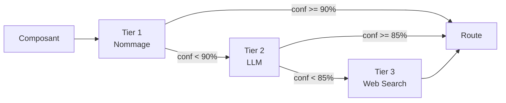
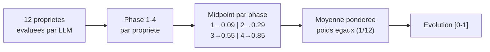

# Strategies d'evaluation

WardleyAssistant utilise deux pipelines d'evaluation complementaires, selectionnes automatiquement selon le type de composant :

- **Capability Strategies** (7 strategies) — pour les capacites abstraites (CRM, container orchestration, data storage)
- **Solution Strategies** (12 proprietes Wardley) — pour les solutions/produits nommes (Kubernetes, Salesforce, SAP ERP)

Le [routage](architecture.md#detection-solution-vs-capability--pipeline-3-tiers) est transparent : l'utilisateur fournit un nom de composant et le systeme detecte automatiquement le type.

---

# Capability Strategies

Les capability strategies evaluent les capacites abstraites via 7 strategies pluggables (s-curve, publication-analysis, timeline-benchmark, llm-direct, logprob-distribution, cpc-evolution, sector-agent). Chaque strategie produit un resultat independant : `{ evolution, confidence, method }`.

## Auto-decouverte

Les strategies sont decouvertes automatiquement au demarrage via `src/work-on-evolution/write/strategies/capacity/registry.mts`. Tout fichier `*-strategy.mts` dans ce dossier est charge et enregistre. Aucune modification du registre n'est necessaire pour ajouter une strategie.

## Interface commune

Chaque strategie etend `BaseStrategy` (`src/work-on-evolution/write/strategies/capacity/base-strategy.mts`) :

```typescript
import { BaseStrategy } from './base-strategy.mjs';
import type { ComponentInput, EvolutionResult } from '../../../types/evolution.mjs';

class MaStrategy extends BaseStrategy {
  static get method(): string { return 'ma-strategy'; }
  async evaluate(component: ComponentInput): Promise<EvolutionResult> {
    return { evolution: 0.75, confidence: 0.85, method: 'ma-strategy' };
  }
}
```

### EvolutionResult

| Champ | Type | Description |
|---|---|---|
| `evolution` | number | Position sur l'axe [0-1] (competitif) ou hors bande (extra-competitif) |
| `confidence` | number [0-1] | Score de confiance |
| `method` | string | Identifiant de la strategie |
| `trace` | array (opt.) | Etapes de raisonnement |

### ComponentInput

| Champ | Type | Description |
|---|---|---|
| `name` | string | Nom du composant |
| `certitude` | number [0-1] | Degre de comprehension |
| `ubiquity` | number [0-1] | Degre de diffusion |
| `wonder` / `build` / `operate` / `usage` | number [0-1] | Proportions de publications |
| `description` | string | Description libre |
| `date` | string/Date | Date de contexte (optionnel) |

---

## 1. S-Curve (`write:capacity:s-curve`)

**Principe** : Projette le couple (certitude, ubiquite) sur le modele dual sigmoide pour obtenir une evolution deterministe.

**Entrees requises** : `certitude`, `ubiquity`

**Modele mathematique** :

Le modele definit deux frontieres (sigmoide generalisee) :

```
f(c) = yMin + (yMax - yMin) * sigmoid(c, k, x0)^nu
```

Parametres par defaut :

| Frontiere | k | x0 | yMin | yMax | nu |
|---|---|---|---|---|---|
| Haute | 8.5 | 0.28 | 0 | 1 | 2.1 |
| Basse | 7 | 0.54 | 0 | 0.98 | 1.7 |

- **Dans la bande** : marche competitif (evolution [0, 1])
- **Hors bande** : extra-competitif (social_good ou common_good)

La confiance depend de la distance a la frontiere : a l'interieur = 0.7-1.0, a l'exterieur = 0.2-0.5.

**Cas d'usage** : Quand les valeurs de certitude et ubiquite sont connues avec precision.

**Fichiers** : `strategies/s-curve-strategy.mts`, `s-curve.mts`

---

## 2. Publication Analysis (`write:capacity:publication-analysis`)

**Principe** : Analyse la distribution des types de publications (wonder/build/operate/usage) pour deduire le stade d'evolution via un centroide pondere.

**Entrees requises** : `wonder`, `build`, `operate`, `usage`

**Centroides de phase** :

| Type | Centroide | Phase |
|---|---|---|
| wonder | 0.09 | Genesis |
| build | 0.22 | Custom-Built |
| operate | 0.48 | Product |
| usage | 0.85 | Commodity |

**Calcul** : `evolution = sum(proportion_i * centroide_i)` apres normalisation.

**Confiance** : Calculee via l'indice de Herfindahl-Hirschman (HHI) — une concentration elevee donne une confiance elevee.

**Fallback** : Si les proportions ne sont pas fournies, appel LLM pour les estimer.

**Fichier** : `strategies/publication-analysis-strategy.mts`

---

## 3. Timeline Benchmark (`write:capacity:timeline-benchmark`)

**Principe** : Construit une timeline historique du composant via des appels LLM iteratifs, puis positionne le composant par rapport aux jalons temporels.

**Entrees requises** : `name`, `description` ou `context`

**Processus** :
1. Identification de la capacite sous-jacente via `identify-capability.mts` (ex: "CRM" → "gestion de la relation client")
2. Construction recursive de la timeline (max 15 iterations) via LLM
3. Chaque jalon evalue par `LLMDirectStrategy` avec contexte temporel
4. Position finale basee sur l'ancrage historique

**Cas d'usage** : Composants avec une histoire connue (technologies, pratiques industrielles).

**Fichier** : `strategies/timeline-benchmark-strategy.mts`

---

## 4. LLM Direct (`write:capacity:llm-direct`)

**Principe** : Demande directement au LLM d'estimer l'evolution, la certitude et l'ubiquite du composant.

**Entrees requises** : `name`, `description` ou `context`

**Important** : Le resultat final est un **blend** de 70% s-curve + 30% estimation LLM directe. Ce n'est pas une estimation LLM pure.

**Confiance** : Basee sur l'accord entre l'estimation s-curve et l'estimation LLM directe.

**Cas d'usage** : Quand aucune donnee numerique n'est disponible.

**Fichier** : `strategies/llm-direct-strategy.mts`

---

## 5. Logprob Distribution (`write:capacity:logprob-distribution`)

**Principe** : Utilise les log-probabilites des tokens du LLM pour analyser la distribution de probabilite sur les 4 stades d'evolution.

**Entrees requises** : `name`, `description` ou `context`

**Backend** : OpenCode API (kimi-k2.5) uniquement — necessite `OPENCODE_API_KEY`.

**Processus** :
1. Le LLM classifie le composant parmi Genesis/Custom/Product/Commodity
2. Extraction des logprobs pour chaque token de phase
3. Conversion softmax → probabilites
4. Centroide pondere sur les midpoints de phase

**Confiance** : Basee sur l'entropie de la distribution — basse entropie = haute confiance.

**Cas d'usage** : Quand on souhaite une mesure d'incertitude basee sur les probabilites du modele.

**Fichier** : `strategies/logprob-distribution-strategy.mts`

---

## 6. Sector Agent (`sector-agent`)

**Principe** : Agent specialise par secteur industriel qui analyse le composant dans son contexte sectoriel specifique.

**Entrees requises** : `name`, `context`

**Processus** :
1. Identification du secteur industriel
2. Comptage des fournisseurs concurrents
3. Evaluation de la standardisation et du cycle d'adoption
4. Cross-validation avec le modele s-curve

**Cas d'usage** : Composants fortement lies a un secteur specifique.

**Fichier** : `strategies/sector-agent-strategy.mts`

---

## Tableau comparatif

| Strategie | Entrees | Backend LLM | Deterministe | Confiance | Complexite |
|---|---|---|---|---|---|
| s-curve | certitude + ubiquity | Non | Oui | Distance bande | Basse |
| publication-analysis | wonder/build/operate/usage | Optionnel | Oui | HHI | Basse |
| timeline-benchmark | name + context | Oui | Non | Richesse timeline | Haute |
| llm-direct | name + context | Oui | Non | Accord s-curve/LLM | Moyenne |
| logprob-distribution | name + context | Oui (OpenCode) | Non | Entropie distribution | Moyenne |
| sector-agent | name + context | Oui | Non | Cross-validation | Haute |

## Orchestration

Le surface MCP propose deux modes routes :

- **`strategy: "auto"`** (defaut) : le router lit `tool.config.json#estimateEvolution.auto.capability` et execute **une seule** strategie (ex. `write:capacity:llm-direct`). Couteux O(1 appel LLM) — adapte au batch (`evaluateMap`).
- **`strategy: "report"`** : le router lit `tool.config.json#estimateEvolution.report.capability` et lance **plusieurs** strategies en parallele (`Promise.allSettled` via `evaluateStrategiesInParallel`). Sortie : map keyed by strategy. Adapte a l'analyse approfondie d'un composant unique.

Une `id` specifique (ex. `"write:capacity:s-curve"`) by-pass le routing et execute cette strategie seule — usage expert.

Le `'all'` historique (qui orchestrait phase A enrichment + phase C s-curve) a ete remplace par cette resolution explicite : si tu veux le comportement multi-strategies, utilise `report` et liste les strategies dans `tool.config.json`. Le `'all'` interne reste utilise par `solution-dispatch` pour signifier "lance les 12 proprietes" — c'est un namespace distinct.

---

# Solution Strategies

Les solution strategies evaluent les **produits et solutions nommes** (Kubernetes, Salesforce, SAP ERP, PostgreSQL...) via le modele des 12 proprietes d'evolution de Wardley.

## Routage automatique

Le systeme detecte automatiquement si un composant est une solution ou une capability via un pipeline 3-tiers :



Le routage est controle par `WARDLEY_EVAL_MODE` :
- **`exclusive`** (defaut) : route vers un seul pipeline (solution OU capability)
- **`parallel`** : route vers les deux pipelines, resultats fusionnes

Voir [architecture.md](architecture.md#detection-solution-vs-capability--pipeline-3-tiers) pour les details du pipeline de detection.

## Les 12 proprietes d'evolution

Chaque solution est evaluee sur 12 proprietes, chacune classee dans une phase (1-4) :

| # | Propriete | Phase 1 (Genesis) | Phase 2 (Custom) | Phase 3 (Product) | Phase 4 (Commodity) |
|---|---|---|---|---|---|
| 1 | **Market** | Indefini | Emergent | Etabli | Mature |
| 2 | **Knowledge management** | Rare, tacite | Fragmente | Largement publie | Ubiquitaire |
| 3 | **Market perception** | Inconnu, experimental | Niche, early adopter | Bien compris | Considere comme acquis |
| 4 | **User perception** | Novel, experimental | Valeur de differenciation | Completude fonctionnelle | Commodity, "ca marche" |
| 5 | **Industry perception** | Curiosite recherche | Potentiel reconnu | Necessite strategique | Infrastructure essentielle |
| 6 | **Value focus** | Nouveaute, exploration | Differenciation, avantage | Fiabilite, TCO, ecosysteme | Cout, standardisation |
| 7 | **Understanding** | Mal compris | Patterns emergents | Architectures etablies | Connaissance commoditisee |
| 8 | **Comparison** | Impossible | Difficile, variable | Feature-by-feature standard | Triviale, interchangeable |
| 9 | **Failure/deficiency** | Elevee, toleree | Courante, decroissante | Notable, suivie | Inacceptable, visible |
| 10 | **Market action** | Exploration, prototypage | Vente directe, consulting | Marketing produit, partenaires | Volume, API, self-service |
| 11 | **Efficiency** | Tres basse | En amelioration | Bonne, ROI mesure | Maximale, automatisee |
| 12 | **Decision driver** | Vision, intuition | Avantage competitif | Feature, TCO, risque | Prix, disponibilite |

Reference complete : `src/solution-strategies/evolution-properties.json`

## Agregation



- Chaque propriete est evaluee a une phase (1 a 4)
- La phase est convertie en valeur d'evolution via les midpoints
- La confiance depend du ratio de proprietes evaluees et du mode (auto vs conversationnel)

## Properties Strategy (`write:solution:properties`)

Seule solution strategy actuellement implementee. Supporte deux modes :

| Mode (interne) | Methode | Description |
|---|---|---|
| **oneshot** | `_evaluateAuto()` | Un seul appel LLM evalue les 12 proprietes |
| **conversational** | `_evaluateConversational()` | Une propriete par appel, pour le mode multi-tour |

> Note : ce `mode` est interne a la solution strategy. Il est independant du `mode` surface MCP (`oneshot` / `conversational` / `default`) du tool `estimateEvolution`.

### SolutionEvolutionResult

Le resultat solution etend `EvolutionResult` avec des champs supplementaires :

| Champ | Type | Description |
|---|---|---|
| `evolution` | number [0-1] | Position sur l'axe d'evolution |
| `confidence` | number [0-1] | Score de confiance |
| `method` | string | `"write:solution:properties"` |
| `properties` | array | Detail par propriete (phase, label, confiance) |
| `stage` | string | Genesis / Custom / Product / Commodity |
| `meanPhase` | number | Phase moyenne (1-4) |
| `phaseDistribution` | object | Nombre de proprietes par phase `{ 1: n, 2: n, 3: n, 4: n }` |
| `dominantPhase` | object | Phase la plus frequente `{ phase, count, label }` |

### Auto-decouverte

Les solution strategies suivent le meme pattern que les capability strategies : tout fichier `*-strategy.mts` dans `src/solution-strategies/` est decouvert automatiquement par `solution-strategies/registry.mts`.

## Fichiers

| Module | Role |
|---|---|
| `solution-strategies/registry.mts` | Auto-decouverte et chargement |
| `solution-strategies/solution-base-strategy.mts` | Classe abstraite (etend `BaseStrategy`) |
| `solution-strategies/properties-strategy.mts` | Evaluation des 12 proprietes |
| `solution-strategies/evolution-properties.json` | Reference des 12 proprietes × 4 phases |
| `solution-strategies/phase-classifier.mts` | Mapping propriete → phase |
| `solution-strategies/aggregate-properties.mts` | Agregation ponderee en evolution |
| `solution-strategies/assemble-result.mts` | Enrichissement des resultats |
| `solution-strategies/solution-evolution-result.mts` | Modele de resultat avec validation |
