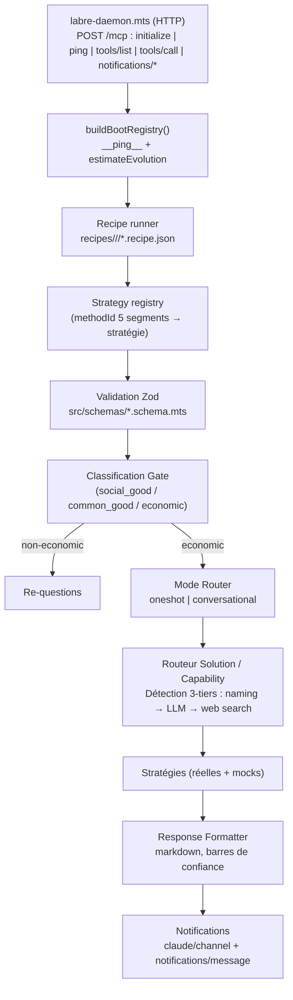
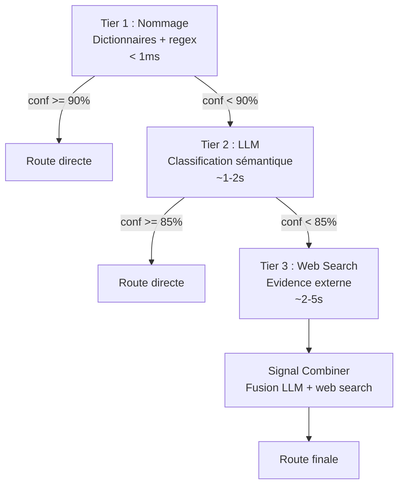

# Architecture

> **Vue conceptuelle.** Pour l'arbre `src/` détaillé, voir [tree-map.md](tree-map.md).
> Pour les détails de chaque couche, voir le cluster `architecture/` :
> [transport.md](../architecture/transport.md), [recipes.md](../architecture/recipes.md),
> [strategies.md](../architecture/strategies.md), [persistence.md](../architecture/persistence.md),
> et le pivot AST faisant autorité [ast-schema.md](../architecture/ast-schema.md).

## Vue d'ensemble

labre-mcp est un serveur MCP exposé via un **daemon HTTP** (`src/core/transport/labre-daemon.mts`)
qui écoute sur `127.0.0.1:6767`. Le protocole applicatif est JSON-RPC 2.0 sur `POST /mcp`
(méthodes `initialize`, `ping`, `tools/list`, `tools/call`, `notifications/*`), avec en plus
`GET /health` et `GET /version`. Le démarrage se fait via `pnpm mcp`.

Au boot, le daemon construit deux registres :

- **Registre d'outils MCP** (`buildBootRegistry()` dans `labre-daemon.mts`) — actuellement
  `__ping__` (smoke) + `estimateEvolution`. L'élargissement de cette surface (evaluateMap,
  identifyCapability, generateValueChain, …) est suivi en [roadmap.md](../architecture/roadmap.md) (item B3).
- **Registre de stratégies** (`src/core/transport/strategy-registry-boot.mts`) — 85 stratégies
  au boot : 15 réelles + 70 mocks. `LABRE_DISABLE_MOCKS=1` ne charge que les 15 réelles.

Chaque outil MCP résout son traitement via une **recipe** (`recipes/<domain>/<tool>/*.recipe.json`)
qui orchestre des appels de stratégies par `methodId`. Les `methodId` suivent la grammaire 5 segments
`domain:tool:sous-domaine:command:strategie@version` — voir [ast-schema.md](../architecture/ast-schema.md).

## Pipeline conceptuel de traitement

## Couche de dégradation

Le framework de dégradation existe sous `src/lib/degradation/` : `withMcpDegradation`
(wrapper de handler établissant un `DegradationCollector` par invocation via AsyncLocalStorage)
et `tryDegradeAmbient` (appels externes BigQuery / LLM / web search). C'est l'**invariant visé**
(AGENT.md hard rule #18). **État actuel** : ce wrapper n'a pas encore d'appelant dans le chemin
de dispatch du daemon (`mcp-handler.dispatch`) — son câblage est suivi en
[roadmap.md](../architecture/roadmap.md) (item B6). Voir [degradation.md](degradation.md) pour le framework.

## Parallélisation des appels indépendants

Partout où le MCP lance plusieurs appels indépendants dans la même invocation, on utilise
**`Promise.allSettled`** — jamais un `for...of + await` séquentiel. Les composants d'une map,
les stratégies d'un mode `report`, et les propriétés solution tournent en parallèle.

**Isolation des collectors** : la parallélisation est sûre parce que `src/lib/degradation/context.mts`
utilise `AsyncLocalStorage`. Chaque branche async d'un `Promise.allSettled` hérite du contexte parent
et voit son propre collector ambient — zéro fuite d'événements entre branches concurrentes.

**Choix délibérés** :
- Pas de borne de concurrence. Les maps larges peuvent saturer un provider LLM ; ces erreurs
  remontent sans bloquer le batch.
- Pas de timeout per-stratégie. Une stratégie lente bloque uniquement son slot, pas le batch.

**Garde pour les nouvelles contributions** : dès qu'un call-site boucle sur un ensemble
d'opérations indépendantes (stratégies, composants, signals), il doit utiliser `Promise.allSettled` —
pas `for...of await`.

## TypeScript strict + Zod

Le projet est en **TypeScript strict** (`tsconfig.json` → `"strict": true`), extensions `.mts`
(ESM strict). La chaîne `tsc` compile `src/**/*.mts` vers `dist/`.

**Zod est la source de vérité unique** pour les schémas (voir [validation.md](validation.md)) :
- `src/schemas/*.schema.mts` définissent les schémas Zod
- Le JSON Schema exposé au client MCP est généré via `z.toJSONSchema(schema, { io: 'input' })`
- Les types TypeScript sont inférés via `z.infer<typeof Schema>`
- Les handlers appellent `Schema.parse(args)` pour valider à l'exécution

Aucune duplication entre le JSON Schema MCP, les interfaces TS et la validation runtime.

## Dual backend LLM

Le système supporte deux backends LLM, sélectionnés via la config par stratégie
(`llm.config.json`, voir [configuration.md](configuration.md)) :

| Backend | Modèle par défaut | Quand | Logprobs |
|---|---|---|---|
| **Claude Agent SDK** | `claude-sonnet-4-6` | Sous-processus MCP (Agent SDK spawne un child) | Non |
| **OpenCode API** | `kimi-k2.5` | Session interactive Claude Code | Oui |

**Pourquoi deux backends ?** Le Claude Agent SDK crée un sous-processus qui entre en conflit
avec une session Claude Code active ; OpenCode (HTTP) évite ce conflit. En développement, le
provider doit pointer vers l'outillage actif (Claude Code → Agent SDK). Le choix est piloté
**par stratégie** dans `llm.config.json` (il n'y a pas de bascule automatique dans le daemon HTTP).

## Détection solution vs capability — pipeline 3-tiers

Le routeur détermine si un composant est une **solution nommée** (Kubernetes, Salesforce, SAP ERP)
ou une **capability abstraite** (container orchestration, CRM, ERP). Le choix du pipeline
d'évaluation en dépend.

Le **Signal Combiner** fusionne les signaux LLM et web search en un verdict unique :
- Accord → bonus de confiance (+0.10)
- Désaccord → poids LLM (0.45) vs web search (0.55), pénalité de confiance (-0.10)
- Signal manquant → dégradation (×0.85)
